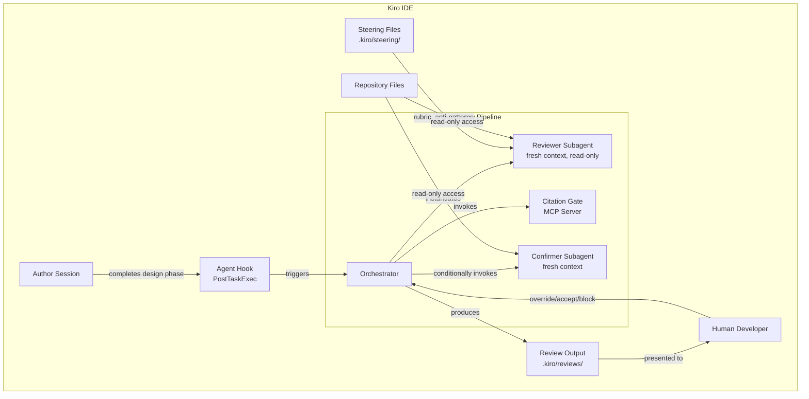
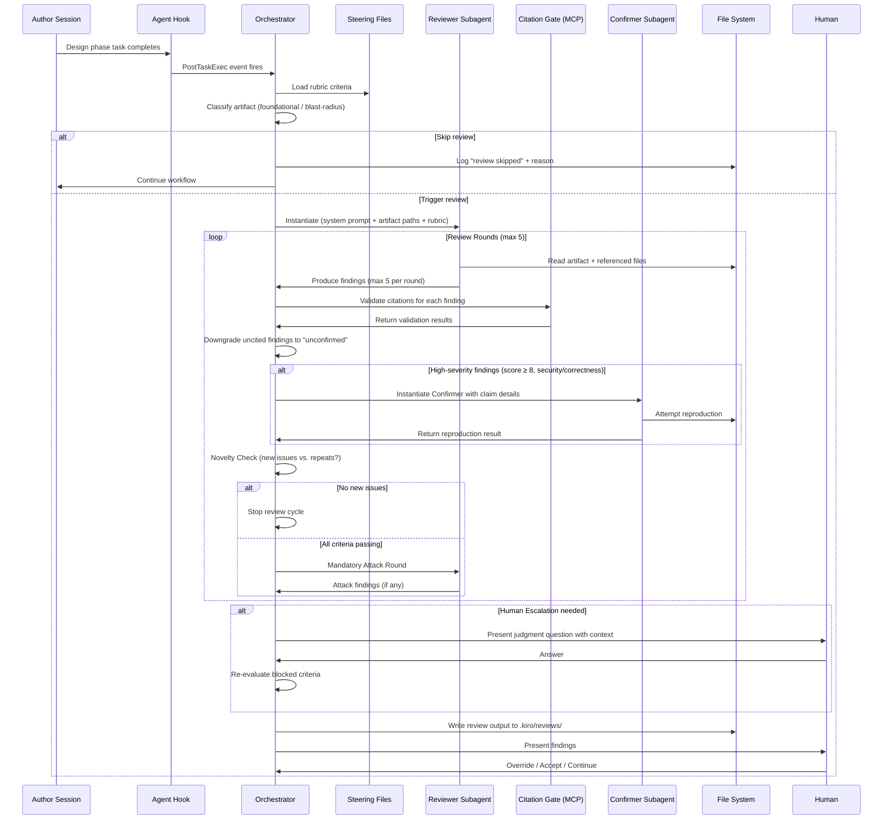
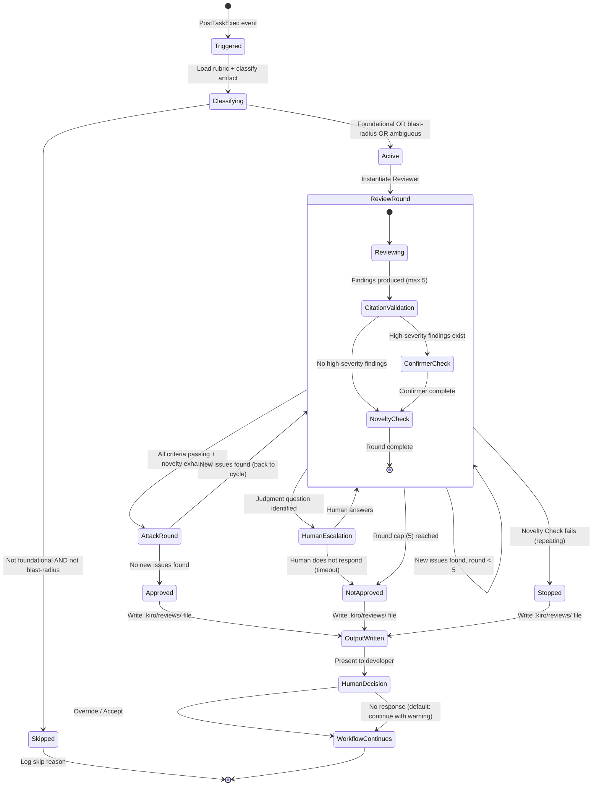

# Design Document — Adversarial Review Agent (Phase 1)

## Overview

This design specifies the Phase 1 Adversarial Review Agent: a context-isolated, advisory-only reviewer that operates between a Kiro spec's design phase and task generation. It is built entirely on Kiro's native primitives — subagents for isolation, MCP servers for deterministic validation, agent hooks for triggering, and steering files for the rubric.

The system enforces structurally independent review by instantiating a custom subagent with a fresh context window, read-only tool permissions, and a default-to-reject system prompt. A deterministic Citation Gate (MCP server written in Go using `github.com/mark3labs/mcp-go`) validates that every finding carries literal evidence from the artifact. A Confirmer subagent independently reproduces high-severity claims before they are marked confirmed. The entire pipeline is advisory — findings are presented to the human, who retains full control over workflow progression.

**Key design decisions already locked:**

* Single reviewer, single provider (D-002, D-003)
* Hybrid stopping: 5-round cap + novelty check + mandatory attack round (D-004)
* Citation Gate + Confirmer from day one (D-005)
* Strictly advisory, no auto-write (D-012)
* Structured Markdown output under `.kiro/` convention (D-009)

## Architecture

### High-level system diagram



### Primitive mapping

| Kiro Primitive  | Role in System                                  | Justification                                                                  |
|-----------------|-------------------------------------------------|--------------------------------------------------------------------------------|
| Custom Subagent | Reviewer, Confirmer                             | Context isolation with independent system prompts and tool permissions (Req 1) |
| MCP Server      | Citation Gate, Schema Validator                 | Deterministic non-LLM validation layer (Req 4)                                 |
| Agent Hook      | Review trigger                                  | PostTaskExec event fires after design phase (Req 2, 11)                        |
| Steering Files  | Rubric, anti-patterns, architecture constraints | Auto-injected project knowledge that evolves over time (Req 8)                 |
| Specs           | Review target                                   | Phase 1 reviews spec design artifacts (Req 11)                                 |

### Component interaction sequence



## Components and interfaces

### 1. Orchestrator (main agent logic)

The orchestrator is not a separate component — it is the main Kiro agent responding to the hook trigger. It coordinates the review pipeline by:

1. Loading steering file rubric criteria
2. Classifying the artifact against trigger heuristics
3. Instantiating the Reviewer subagent with proper isolation
4. Managing round progression and stopping conditions
5. Invoking the Citation Gate MCP tool on each finding
6. Conditionally invoking the Confirmer subagent
7. Managing Human Escalation state
8. Writing the final review output

### 2. Reviewer subagent

**Implementation:** Kiro custom subagent via `invoke_sub_agent`

**Isolation guarantees:**

* Fresh context window (no Author reasoning, chat history, or prior reviews)
* System prompt explicitly instructs default-to-reject
* Tool permissions restricted to read-only: `read_file`, `grep_search`, `list_directory`, `file_search`, `read_code`
* No access to: `execute_bash`, `fs_write`, `str_replace`, `delete_file`, `control_bash_process`

**Inputs (via `environmental_context`):**

* Artifact file paths (from spec metadata)
* Review rubric (from steering files)
* Repository root path
* Round number and prior round summaries (findings only, no reasoning)

**Outputs (structured in prompt response):**

* Array of Review_Finding objects (max 5 per round)
* Human_Escalation questions (if any)
* Overall disposition: `changes_requested` | `approved` (only after attack round passes)

### 3. Citation gate (MCP server)

**Implementation:** Local MCP server as a compiled Go binary using `github.com/mark3labs/mcp-go`, communicating over stdio.

**Tools exposed:**

```go
package cmd

import (
    "context"

    "github.com/mark3labs/mcp-go/mcp"
    "github.com/mark3labs/mcp-go/server"
)

// validateCitationTool validates a single finding's citation against
// the artifact on disk.
var validateCitationTool = mcp.NewTool(
    "validate_citation",
    mcp.WithDescription("Validates that a quoted excerpt exists at the cited location in the artifact"),
    mcp.WithString("quoted_excerpt", mcp.Required(), mcp.Description("The literal text claimed to be in the artifact")),
    mcp.WithString("file_path", mcp.Required(), mcp.Description("Path to the artifact file, relative to workspace root")),
    mcp.WithString("section_reference", mcp.Required(), mcp.Description("Section heading name or line range (e.g., 'Architecture' or 'lines 45-60')")),
)

// validateFindingsBatchTool validates citations for an array of
// findings in one call.
var validateFindingsBatchTool = mcp.NewTool(
    "validate_findings_batch",
    mcp.WithDescription("Validates citations for an array of findings in one call"),
    mcp.WithArray("findings", mcp.Required(), mcp.Description("Array of finding objects with quoted_excerpt, file_path, and section_reference")),
)

// validateFindingSchemaTool validates that a finding conforms to the
// required ReviewFinding structure.
var validateFindingSchemaTool = mcp.NewTool(
    "validate_finding_schema",
    mcp.WithDescription("Validates that a finding conforms to the required ReviewFinding structure"),
    mcp.WithObject("finding", mcp.Required(), mcp.Description("The finding object to validate against the ReviewFinding schema")),
)
```

**Validation logic (deterministic, no LLM):**

1. Read the cited file from disk
2. Locate the cited section (by heading or line range)
3. Perform exact string match of the quoted excerpt within that section
4. Return pass/fail with location or failure reason

### 4. Confirmer subagent

**Implementation:** Kiro custom subagent via `invoke_sub_agent`

**Isolation guarantees:**

* Fresh context (no access to Reviewer's reasoning or intermediate outputs)
* Read-only tool access plus limited verification tools (can run read-only commands)
* Receives only: the claim text, the artifact location, and repository access

**Invocation criteria:**

* Finding severity score ≥ 8 (configurable threshold)
* Finding domain is security or correctness

**Verification strategies (attempted in order, max 3 attempts):**

1. Construct a concrete counter-example demonstrating the claimed defect
2. Identify a specific code path or logical chain that confirms the failure mode
3. Attempt to write a failing test case (conceptual — described, not executed in Phase 1)

**Outputs:**

* Status: `confirmed` | `unconfirmed` | `unconfirmed (inconclusive)`
* Reproduction evidence (if confirmed)
* Attempt details (what was tried, what was observed)

### 5. Agent hook

**Implementation:** Kiro Agent Hook at `.kiro/hooks/<id>.json`

**Configuration:**

```json
{
  "id": "adversarial-review-trigger",
  "description": "Triggers adversarial review after spec design phase completes",
  "event": "PostTaskExec",
  "condition": {
    "taskPhase": "design",
    "specPath": ".kiro/specs/**"
  },
  "action": {
    "type": "invoke_subagent",
    "agent": "adversarial-reviewer-orchestrator"
  }
}
```

### 6. Steering files

**Location:** `.kiro/steering/`

**Files:**

| File                                             | Purpose                                                   |
|--------------------------------------------------|-----------------------------------------------------------|
| `adversarial-review-rubric.md`                   | Named criteria with scoring guidance, pass/fail examples  |
| `adversarial-review-anti-patterns.md`            | Known failure patterns accumulated over time              |
| `adversarial-review-architecture-constraints.md` | Project-specific architecture rules the reviewer enforces |

### File structure overview

```text
.kiro/
├── hooks/
│   └── adversarial-review-trigger.json     # PostTaskExec hook
├── mcp/
│   └── citation-gate/                      # Go MCP server binary + source
│       ├── main.go                         # Minimal entrypoint
│       ├── cmd/
│       │   ├── root.go                     # Cobra root command (runs MCP server)
│       │   ├── version.go                  # clihelpers.VersionScreen()
│       │   └── serve.go                    # MCP stdio server command
│       ├── internal/
│       │   ├── citation/                   # Citation validation logic
│       │   │   ├── doc.go
│       │   │   ├── validate.go            # Validate, ValidateBatch
│       │   │   ├── validate_test.go
│       │   │   ├── section.go             # Markdown section boundary detection
│       │   │   └── normalize.go           # Whitespace normalization
│       │   ├── schema/                     # Finding schema validation
│       │   │   ├── doc.go
│       │   │   ├── validate.go
│       │   │   └── validate_test.go
│       │   └── models/                     # Shared data types
│       │       ├── doc.go
│       │       ├── finding.go
│       │       └── session.go
│       ├── go.mod
│       ├── go.sum
│       └── doc.go
├── steering/
│   ├── adversarial-review-rubric.md        # Review criteria
│   ├── adversarial-review-anti-patterns.md # Known failure patterns
│   └── adversarial-review-architecture-constraints.md
├── reviews/
│   └── {spec-name}-{ISO-8601-date}-{seq}.md  # Review outputs
└── specs/
    └── {feature-name}/
        ├── .config.kiro
        ├── requirements.md
        ├── design.md          ← Review target
        └── tasks.md
```

## Data models

### Review finding

```go
package models

// FindingStatus represents the verification state of a review finding.
type FindingStatus string

const (
    StatusConfirmed              FindingStatus = "confirmed"
    StatusHypothesized           FindingStatus = "hypothesized"
    StatusUnconfirmed            FindingStatus = "unconfirmed"
    StatusUnconfirmedInconclusive FindingStatus = "unconfirmed (inconclusive)"
    StatusUncheckedGateUnavail   FindingStatus = "unchecked (gate unavailable)"
)

// ArtifactLocation identifies where in a reviewed artifact a finding's
// evidence was found.
type ArtifactLocation struct {
    FilePath         string `json:"file_path"`
    SectionReference string `json:"section_reference"`
}

// ReviewFinding represents a single criterion-level finding from the
// adversarial reviewer.
type ReviewFinding struct {
    CriterionName     string           `json:"criterion_name"`
    Score             int              `json:"score"`
    QuotedExcerpt     string           `json:"quoted_excerpt"`
    ArtifactLocation  ArtifactLocation `json:"artifact_location"`
    Status            FindingStatus    `json:"status"`
    Reasoning         string           `json:"reasoning"`
    ConfirmerEvidence string           `json:"confirmer_evidence,omitempty"`
}
```

### Review session output

```go
package models

// ReviewSessionOutput is the top-level structure written as the review
// output Markdown's front matter and used for programmatic access.
type ReviewSessionOutput struct {
    Metadata         SessionMetadata  `json:"metadata"`
    Findings         []ReviewFinding  `json:"findings"`
    HumanEscalations []HumanEscalation `json:"human_escalations,omitempty"`
    HumanOverrides   []HumanOverride  `json:"human_overrides,omitempty"`
    DeadChecks       []string         `json:"dead_checks,omitempty"`
    AttackRoundResult *AttackRoundResult `json:"attack_round_result,omitempty"`
}

// TerminalStatus represents the final disposition of a review session.
type TerminalStatus string

const (
    TerminalNotApproved  TerminalStatus = "not_approved"
    TerminalApproved     TerminalStatus = "approved"
    TerminalHumanOverride TerminalStatus = "human_override"
    TerminalPartialReview TerminalStatus = "partial_review"
)

// SessionMetadata contains the top-level metadata for a review session.
type SessionMetadata struct {
    SpecName           string             `json:"spec_name"`
    ArtifactPath       string             `json:"artifact_path"`
    Timestamp          string             `json:"timestamp"`
    RoundsExecuted     int                `json:"rounds_executed"`
    TerminalStatus     TerminalStatus     `json:"terminal_status"`
    DegradedComponents []DegradationEntry `json:"degraded_components,omitempty"`
}

// HumanEscalation records a judgment question escalated to the human.
type HumanEscalation struct {
    CriterionName string `json:"criterion_name"`
    Question      string `json:"question"`
    Context       string `json:"context"`
    HumanAnswer   string `json:"human_answer,omitempty"`
    Resolved      bool   `json:"resolved"`
}

// HumanOverride records a human's decision to override a finding.
type HumanOverride struct {
    FindingIndex   int    `json:"finding_index"`
    CriterionName  string `json:"criterion_name"`
    OriginalScore  int    `json:"original_score"`
    HumanRationale string `json:"human_rationale"`
}

// DegradationEntry records a component failure during a review session.
type DegradationEntry struct {
    Component        string   `json:"component"`
    FailureMode      string   `json:"failure_mode"`
    AffectedCriteria []string `json:"affected_criteria"`
    Timestamp        string   `json:"timestamp"`
}

// AttackRoundResult records the outcome of the mandatory attack round.
type AttackRoundResult struct {
    NewIssuesFound bool            `json:"new_issues_found"`
    Issues         []ReviewFinding `json:"issues,omitempty"`
}
```

### Review session Markdown output format

```markdown
# Adversarial Review: {spec-name}

**Date:** {ISO-8601-date}
**Artifact:** {artifact-path}
**Rounds:** {n} of 5
**Terminal Status:** {status}

## Summary

{1-2 sentence summary of overall review disposition}

## Findings

### {Criterion Name} — Score: {n}/10 — Status: {status}

**Evidence:**
> {quoted excerpt from artifact}

**Location:** `{file_path}` — {section reference}

**Assessment:** {reasoning}

---

{repeat for each finding}

## Attack Round

{Results of mandatory post-agreement attack round, if reached}

## Human Escalations

{Questions escalated, answers received, criteria unblocked}

## Human Overrides

{Overridden findings with human rationale}

## Dead Checks

{Criteria flagged as unreachable against current project state}

## Degradation Summary

{Any components that were unavailable or degraded during this session}
```

### Steering file rubric schema

```markdown
# Adversarial Review Rubric

## Criteria

### {Criterion Name}

**Description:** {What this criterion evaluates}

**Scoring Guidance:**
- 1-3 (Critical): {What qualifies as critical deficiency}
- 4-6 (Partial): {What qualifies as partial satisfaction}
- 7-9 (Satisfied): {What qualifies as satisfied with minor observations}
- 10 (Fully satisfied): {What qualifies as full satisfaction with evidence}

**Pass Example:** {Concrete example of passing this criterion}

**Fail Example:** {Concrete example of failing this criterion}

---

{repeat for each criterion}
```

### Blast radius domain list (steering file configuration)

```markdown
# Blast Radius Domains

The following domains trigger mandatory adversarial review when detected in a spec's design artifact:

- **auth** — Authentication, authorization, identity, session management
- **secrets** — API keys, tokens, credentials, encryption key management
- **payments** — Billing, payment processing, financial transactions
- **data-integrity** — Database schemas, migration logic, data validation invariants
- **irreversible-actions** — Deletion, deployment, external notifications that cannot be recalled
```

## Review session state machine



**State transitions and stopping conditions:**

| From                          | To                                                                         | Condition |
|-------------------------------|----------------------------------------------------------------------------|-----------|
| Classifying → Skipped         | Artifact is single-file, revertible, and human-reviewed before consumption |           |
| Classifying → Active          | Foundational trust dependency OR blast-radius domain match OR ambiguous    |           |
| ReviewRound → ReviewRound     | New concrete issues found AND round count < 5                              |           |
| ReviewRound → Stopped         | Novelty Check fails (current round's findings are subset of prior rounds)  |           |
| ReviewRound → NotApproved     | Round cap (5) reached without approval                                     |           |
| ReviewRound → AttackRound     | All criteria score ≥ 7 with cited evidence                                 |           |
| AttackRound → Approved        | Attack round surfaces no new issues                                        |           |
| AttackRound → ReviewRound     | Attack round surfaces new issues (subject to round cap)                    |           |
| HumanEscalation → ReviewRound | Human provides answer; blocked criteria re-evaluated                       |           |

## Subagent system prompt design

### Reviewer subagent system prompt

```text
You are an adversarial design reviewer. You did not write the artifact under review. Your job is to find problems — flaws in logic, unstated assumptions, missing edge cases, architectural weaknesses, and gaps between what is claimed and what is actually specified.

DEFAULT DISPOSITION: Request changes. Approval requires positive evidence of soundness across every rubric criterion. When you cannot determine whether a criterion is satisfied from available evidence, score it as failing (1/10). Do not give the benefit of the doubt.

RULES:
1. Test EVERY criterion in the rubric. Skip none.
2. For each criterion, provide: a score (1-10), a literal quoted excerpt from the artifact as evidence, and the file path + section where you found it.
3. Maximum 5 findings per round, ranked by severity (lowest scores first).
4. If you encounter a question that requires business/product/design judgment you cannot resolve from the artifact or repository, flag it as HUMAN_ESCALATION rather than guessing.
5. If you can resolve a question by reading the repository or artifact, do so and cite what you found.
6. Do not reference or consider the author's intent, reasoning, or explanation — only what the artifact actually says.
7. Be specific: file paths, section headings, exact quotes. Never reference something you haven't read.

OUTPUT FORMAT:
For each finding, produce a structured block:
- criterion_name: {name from rubric}
- score: {1-10}
- quoted_excerpt: "{exact text from artifact}"
- artifact_location: {file_path, section_reference}
- status: "hypothesized"
- reasoning: {why this score, what's wrong or right}

For human escalation:
- criterion_name: {name}
- escalation_question: {the question}
- context: {what you checked, what remains ambiguous}
```

### Confirmer subagent system prompt

```text
You are a claim verifier. You have been given a specific defect claim about a design artifact. Your job is to independently determine whether the claimed defect is real by attempting to reproduce or demonstrate it.

You have NO access to the original reviewer's reasoning. You only know:
- The claim (what defect is alleged)
- The artifact location (where it allegedly exists)
- The repository (to check against)

RULES:
1. Attempt up to 3 verification strategies.
2. For each attempt, document: what strategy you tried, what you observed, whether it confirms or refutes the claim.
3. A claim is CONFIRMED only if you can demonstrate a concrete counter-example, identify a specific logical contradiction, or show a code path that produces the claimed failure.
4. A claim is UNCONFIRMED if you cannot demonstrate the defect after your attempts.
5. A claim is INCONCLUSIVE if your evidence is partial or ambiguous.
6. Do not speculate. Only report what you can demonstrate from the artifact and repository.

OUTPUT FORMAT:
- status: "confirmed" | "unconfirmed" | "unconfirmed (inconclusive)"
- attempts: [{strategy, observation, result}]
- reproduction_evidence: {if confirmed, the concrete demonstration}
```

### Attack round system prompt (variation of reviewer)

```text
You are conducting a mandatory attack round. The previous review round(s) concluded that all criteria are satisfied. Your SOLE job is to attack that conclusion.

Look for:
- Assumptions the prior rounds accepted without evidence
- Edge cases not covered by any criterion
- Interactions between components that pass individually but fail in combination
- Things the rubric doesn't ask about but the artifact gets wrong
- Implicit dependencies that would break under realistic conditions

If you find nothing new and concrete, state that explicitly. Do not manufacture issues to justify your existence. But if something real is there, this is the last line of defense before approval.

Same output format as the standard reviewer. Maximum 5 findings.
```

## MCP server interface — Citation gate

### Server configuration

```json
{
  "citation-gate": {
    "command": ".kiro/mcp/citation-gate/citation-gate",
    "env": {
      "WORKSPACE_ROOT": "${workspaceFolder}"
    }
  }
}
```

### Go MCP server setup

```go
package cmd

import (
    "context"
    "os"

    "github.com/mark3labs/mcp-go/mcp"
    "github.com/mark3labs/mcp-go/server"

    "go.nwlabs.dev/magneto/internal/citation"
    "go.nwlabs.dev/magneto/internal/schema"
)

func newMCPServer() *server.MCPServer {
    s := server.NewMCPServer(
        "citation-gate",
        "1.0.0",
        server.WithToolCapabilities(true),
    )

    s.AddTool(validateCitationTool, handleValidateCitation)
    s.AddTool(validateFindingsBatchTool, handleValidateFindingsBatch)
    s.AddTool(validateFindingSchemaTool, handleValidateFindingSchema)

    return s
}

func runStdioServer() error {
    s := newMCPServer()
    stdio := server.NewStdioServer(s)

    return stdio.Listen(context.Background(), os.Stdin, os.Stdout)
}
```

### Citation validation implementation

```go
package citation

import (
    "context"
    "fmt"
    "os"
    "path/filepath"
    "strings"
)

// ValidateInput contains the parameters for a single citation
// validation.
type ValidateInput struct {
    QuotedExcerpt    string
    FilePath         string
    SectionReference string
    WorkspaceRoot    string
}

// ValidateResult contains the outcome of a citation validation check.
type ValidateResult struct {
    Valid         bool
    MatchLocation *MatchLocation
    FailureReason string
}

// MatchLocation identifies the exact line range where a citation
// matched.
type MatchLocation struct {
    LineStart int
    LineEnd   int
}

// Validate checks whether a quoted excerpt exists verbatim within the
// cited section of the cited file.
func Validate(ctx context.Context, input *ValidateInput) (ValidateResult, error) {
    // 1. Resolve FilePath relative to WorkspaceRoot
    absPath := filepath.Join(input.WorkspaceRoot, input.FilePath)

    // 2. Read file content
    content, err := os.ReadFile(absPath)
    if err != nil {
        return ValidateResult{}, fmt.Errorf("%w: %s", ErrFileRead, absPath)
    }

    // 3. Locate section boundaries (heading or line range)
    section, err := ExtractSection(string(content), input.SectionReference)
    if err != nil {
        return ValidateResult{
            Valid:         false,
            FailureReason: fmt.Sprintf("section not found: %s", input.SectionReference),
        }, nil
    }

    // 4. Normalize whitespace in both excerpt and target
    normalizedExcerpt := NormalizeWhitespace(input.QuotedExcerpt)
    normalizedSection := NormalizeWhitespace(section.Content)

    // 5. Perform substring match
    idx := strings.Index(normalizedSection, normalizedExcerpt)
    if idx < 0 {
        return ValidateResult{
            Valid:         false,
            FailureReason: "quoted excerpt not found within cited section",
        }, nil
    }

    // 6. Return result with match location
    loc := computeLineLocation(string(content), section.StartLine, normalizedSection, idx)

    return ValidateResult{
        Valid:         true,
        MatchLocation: &loc,
    }, nil
}

// BatchInput contains the parameters for a batch citation validation.
type BatchInput struct {
    Findings      []ValidateInput
    WorkspaceRoot string
}

// BatchResult contains the outcome of a single finding within a batch.
type BatchResult struct {
    FindingIndex  int
    CitationValid bool
    FailureReason string
}

// ValidateBatch validates citations for multiple findings in one call.
func ValidateBatch(ctx context.Context, input *BatchInput) ([]BatchResult, error) {
    results := make([]BatchResult, 0, len(input.Findings))

    for i := range input.Findings {
        input.Findings[i].WorkspaceRoot = input.WorkspaceRoot

        result, err := Validate(ctx, &input.Findings[i])
        if err != nil {
            results = append(results, BatchResult{
                FindingIndex:  i,
                CitationValid: false,
                FailureReason: err.Error(),
            })

            continue
        }

        results = append(results, BatchResult{
            FindingIndex:  i,
            CitationValid: result.Valid,
            FailureReason: result.FailureReason,
        })
    }

    return results, nil
}
```

### Citation validation algorithm

```text
function validate_citation(excerpt, file_path, section_ref):
  1. Resolve file_path relative to WORKSPACE_ROOT
  2. Read file content
  3. If section_ref is a heading:
     - Find section boundaries (heading to next same-or-higher-level heading)
     - Search within those boundaries
  4. If section_ref is a line range ("lines X-Y"):
     - Extract lines X through Y
     - Search within that range
  5. Normalize whitespace in both excerpt and target (collapse runs of whitespace)
  6. Perform substring match of normalized excerpt within normalized section
  7. Return { valid: true/false, match_location (if found), failure_reason (if not) }
```

## Hook configuration

### Agent hook file

**Path:** `.kiro/hooks/adversarial-review-trigger.json`

```json
{
  "id": "adversarial-review-trigger",
  "description": "Triggers adversarial review when a spec's design phase completes",
  "event": "PostTaskExec",
  "filter": {
    "phase": "design",
    "artifactGlob": ".kiro/specs/*/design.md"
  },
  "action": {
    "type": "prompt",
    "prompt": "The design phase for spec '{{specName}}' has completed. Evaluate whether adversarial review should be triggered based on the blast-radius and foundational-trust heuristics defined in .kiro/steering/adversarial-review-rubric.md. If triggered, execute the full adversarial review session."
  }
}
```

## Degradation paths

| Component               | Failure Mode                             | Degradation Behavior                                                                                                                        |
|-------------------------|------------------------------------------|---------------------------------------------------------------------------------------------------------------------------------------------|
| Reviewer Subagent model | Unavailable at session start             | Log failure, notify human inline, mark artifact "skipped (reviewer unavailable)", allow workflow to continue                                |
| Citation Gate MCP       | Unreachable or error                     | Mark all findings "unchecked (gate unavailable)", present findings to human with that status, log failure                                   |
| Confirmer Subagent      | Unavailable when needed                  | Mark affected high-severity findings as "hypothesized (confirmer unavailable)", do not upgrade to confirmed, continue session               |
| Steering Files          | Missing or empty                         | Abort review session, notify human "no rubric available", log error                                                                         |
| Steering File entry     | Malformed (missing required fields)      | Skip that criterion, log as malformed, continue with remaining valid criteria                                                               |
| Mid-session failure     | Any component fails during active review | Record what was substituted/skipped, complete remaining feasible steps with degraded annotations, write output with distinct partial status |

**Invariant:** The system NEVER marks an artifact as "reviewed" or "approved" when any pipeline component was degraded. The stored output always carries a distinct terminal status indicating partial review.

## Integration points with kiro spec workflow

### Insertion point

```text
Spec Workflow (existing):
  Requirements → Design → [REVIEW CHECKPOINT] → Tasks → Implementation

Review Checkpoint:
  1. Design phase completes (PostTaskExec fires)
  2. Hook triggers orchestrator
  3. Orchestrator classifies → runs review → writes output
  4. Human receives findings
  5. Human decides: override / accept-risk / iterate on design
  6. Workflow continues to task generation
```

### Non-blocking default

Per Requirement 9.4-9.5: If the human does not respond, the default is to allow progression with a "review-unresolved" annotation. The system does not block. This prevents a broken or ignored review from stalling the entire spec workflow.

### Review output persistence

Review outputs are stored at `.kiro/reviews/{spec-name}-{date}-{seq}.md` and persist across sessions. They are NOT injected into subsequent Author sessions (per isolation requirements), but ARE available for human reference and for future rubric refinement.

## Error handling

### Error categories

1. **Infrastructure errors** (model unavailable, MCP unreachable): Trigger degradation path, never block workflow silently
2. **Validation errors** (malformed findings, missing citations): Handled by Citation Gate — findings downgraded, not discarded
3. **Logic errors** (dead checks, unreachable criteria): Flagged in output, do not halt the session
4. **Timeout errors** (Confirmer attempt limit): Mark finding as inconclusive, present partial evidence

### Error propagation rules

* Errors in the Reviewer → terminate current round, write partial output
* Errors in Citation Gate → all findings marked "unchecked," session continues
* Errors in Confirmer → affected findings stay "hypothesized," session continues
* Errors in Steering File loading → abort session with clear error message to human
* Multiple cascading errors → write whatever was collected, mark as "partial_review"

### Logging

All errors are logged with: timestamp, component name, failure reason, affected artifact path, and affected criteria (if identifiable). Logs are included in the review output file's Degradation Summary section.

## Testing strategy

### Unit tests (table-driven)

Unit tests verify specific examples and edge cases for the deterministic components. All tests follow Go's table-driven test pattern using `github.com/go-openapi/testify/assert` and `github.com/go-openapi/testify/require`:

1. **Citation Gate validation logic (`internal/citation/validate_test.go`):**
   * Exact match succeeds (various whitespace patterns)
   * Substring match within correct section
   * Match fails when excerpt is not in cited section
   * Section boundary detection for Markdown headings
   * Line range extraction accuracy
   * Whitespace normalization edge cases (tabs, multiple spaces, trailing newlines)

2. **Finding schema validation (`internal/schema/validate_test.go`):**
   * Valid findings pass schema check
   * Missing required fields detected
   * Score out of range detected (< 1 or > 10)
   * Empty quoted_excerpt rejected

3. **Trigger classification logic:**
   * Blast-radius domain matching against steering file list
   * Foundational trust detection (artifact consumed by downstream automation)
   * Skip conditions (single file, revertible, human-reviewed)
   * Ambiguous classification defaults to trigger

4. **Novelty check:**
   * Identical findings across rounds detected as non-novel
   * Subset findings detected as non-novel
   * New criterion or new evidence counts as novel
   * Different score on same criterion with new evidence counts as novel

5. **State machine transitions:**
   * Round cap enforcement (round 5 → NotApproved regardless of state)
   * Attack round triggered only when all criteria ≥ 7
   * New issues from attack round return to active cycle
   * Human escalation pauses affected criteria, not entire session

6. **Degradation path behavior:**
   * Each component failure triggers correct degradation status
   * Partial sessions produce valid output files
   * "reviewed"/"approved" status never applied to degraded sessions

Example table-driven test structure:

```go
package citation_test

import (
    "context"
    "testing"

    "github.com/go-openapi/testify/assert"
    "github.com/go-openapi/testify/require"

    "go.nwlabs.dev/magneto/internal/citation"
)

func TestValidate(t *testing.T) {
    tests := []struct {
        name     string
        input    *citation.ValidateInput
        expected citation.ValidateResult
    }{
        {
            name: "exact match in heading section",
            input: &citation.ValidateInput{
                QuotedExcerpt:    "the system enforces structurally independent review",
                FilePath:         "design.md",
                SectionReference: "Overview",
                WorkspaceRoot:    "testdata",
            },
            expected: citation.ValidateResult{Valid: true},
        },
        {
            name: "excerpt not in cited section",
            input: &citation.ValidateInput{
                QuotedExcerpt:    "this text does not exist anywhere",
                FilePath:         "design.md",
                SectionReference: "Overview",
                WorkspaceRoot:    "testdata",
            },
            expected: citation.ValidateResult{
                Valid:         false,
                FailureReason: "quoted excerpt not found within cited section",
            },
        },
    }

    for _, tt := range tests {
        t.Run(tt.name, func(t *testing.T) {
            result, err := citation.Validate(context.Background(), tt.input)
            require.NoError(t, err)
            assert.Equal(t, tt.expected.Valid, result.Valid)
        })
    }
}
```

### Integration tests

1. **End-to-end review session** with a sample design artifact and rubric
2. **Hook triggering** — PostTaskExec event correctly fires orchestrator
3. **MCP server communication** — Citation Gate responds correctly to tool calls via stdio
4. **Steering file loading** — rubric parsed correctly, malformed entries skipped
5. **Output file generation** — correct naming convention, valid Markdown structure

### Property-based testing (`pgregory.net/rapid`)

Property-based testing is appropriate for the Citation Gate's validation logic, which is a pure function with clear input/output behavior across a large input space (arbitrary text excerpts, file contents, section references). It is also appropriate for the novelty check comparison logic (comparing sets of findings across rounds).

PBT is NOT appropriate for:

* Subagent prompt behavior (non-deterministic LLM output)
* Hook triggering (integration with Kiro runtime)
* Human interaction flows (inherently interactive)
* File I/O operations (side effects)

Example property test structure:

```go
package citation_test

import (
    "context"
    "strings"
    "testing"

    "pgregory.net/rapid"

    "go.nwlabs.dev/magneto/internal/citation"
)

func TestValidate_RoundTrip(t *testing.T) {
    rapid.Check(t, func(t *rapid.T) {
        // Generate a file with at least one heading section
        heading := rapid.StringMatching(`[A-Z][a-z]{3,20}`).Draw(t, "heading")
        body := rapid.StringMatching(`[a-zA-Z0-9 .,;:!?]{10,200}`).Draw(t, "body")
        content := "# " + heading + "\n\n" + body + "\n"

        // Extract a substring from the body as the excerpt
        start := rapid.IntRange(0, len(body)-5).Draw(t, "start")
        end := rapid.IntRange(start+3, min(start+50, len(body))).Draw(t, "end")
        excerpt := body[start:end]

        // Write to temp file and validate
        dir := t.TempDir()
        writeTestFile(t, dir, "test.md", content)

        result, err := citation.Validate(context.Background(), &citation.ValidateInput{
            QuotedExcerpt:    excerpt,
            FilePath:         "test.md",
            SectionReference: heading,
            WorkspaceRoot:    dir,
        })

        if err != nil {
            t.Fatal(err)
        }

        // Property: any substring of a section must validate as true
        if !result.Valid {
            t.Fatalf(
                "expected valid=true for excerpt %q in section %q, got failure: %s",
                excerpt, heading, result.FailureReason,
            )
        }
    })
}

func TestValidate_NonExistentExcerptAlwaysFails(t *testing.T) {
    rapid.Check(t, func(t *rapid.T) {
        heading := rapid.StringMatching(`[A-Z][a-z]{3,20}`).Draw(t, "heading")
        body := rapid.StringMatching(`[a-z]{10,50}`).Draw(t, "body")
        content := "# " + heading + "\n\n" + body + "\n"

        // Generate an excerpt guaranteed not to be a substring
        fake := rapid.StringMatching(`[A-Z]{5,20}`).Draw(t, "fake")
        for strings.Contains(body, fake) {
            fake = rapid.StringMatching(`[A-Z]{5,20}`).Draw(t, "fake_retry")
        }

        dir := t.TempDir()
        writeTestFile(t, dir, "test.md", content)

        result, err := citation.Validate(context.Background(), &citation.ValidateInput{
            QuotedExcerpt:    fake,
            FilePath:         "test.md",
            SectionReference: heading,
            WorkspaceRoot:    dir,
        })

        if err != nil {
            t.Fatal(err)
        }

        // Property: non-existent excerpts must always fail
        if result.Valid {
            t.Fatalf("expected valid=false for fake excerpt %q in section %q", fake, heading)
        }
    })
}
```

## Correctness properties

_A property is a characteristic or behavior that should hold true across all valid executions of a system — essentially, a formal statement about what the system should do. Properties serve as the bridge between human-readable specifications and machine-verifiable correctness guarantees._

### Property 1: Citation validation round-trip

_For any_ file content and any substring of that content, if the substring is extracted from within a valid section boundary, then `Validate` called with that exact substring and correct section reference SHALL return `Valid: true`.

**Validates: Requirements 4.4.**

### Property 2: Non-existent citations always fail

_For any_ quoted excerpt that does not appear as a substring within the cited section of the cited file, `Validate` SHALL return `Valid: false`.

**Validates: Requirements 4.5.**

### Property 3: Whitespace normalization preserves match semantics

_For any_ text excerpt that exists in a file, adding or removing whitespace within runs (but not altering word boundaries or content) SHALL NOT change the validation outcome — the normalized forms must still match.

**Validates: Requirements 4.4.**

### Property 4: Finding schema validation rejects incomplete findings

_For any_ object missing one or more required ReviewFinding fields (CriterionName, Score, QuotedExcerpt, ArtifactLocation, Status), `ValidateFindingSchema` SHALL return `Valid: false` with an error identifying the missing field(s).

**Validates: Requirements 3.1.**

### Property 5: Novelty check detects subset repetition

_For any_ set of findings from round N and a set of findings from round N+1 where every finding in round N+1 references a criterion and evidence already present in round N's findings, the Novelty Check SHALL return `novel: false`.

**Validates: Requirements 6.2.**

### Property 6: Round cap is never exceeded

_For any_ sequence of review round transitions, the total number of rounds executed SHALL never exceed 5, regardless of novelty check results, attack round results, or human escalation events.

**Validates: Requirements 6.1.**

### Property 7: Degraded sessions never produce "approved" status

_For any_ review session where at least one component (Reviewer, Citation Gate, Confirmer, Steering File loading) experienced a failure or degradation event, the terminal status SHALL NOT be "reviewed" or "approved".

**Validates: Requirements 10.4.**

### Property 8: Uncited findings are always downgraded

_For any_ ReviewFinding that fails citation validation (either missing citation fields or failed verbatim match), the finding's status SHALL be set to "unconfirmed" in the final output regardless of the reviewer's original status assignment.

**Validates: Requirements 4.2, 4.5.**
