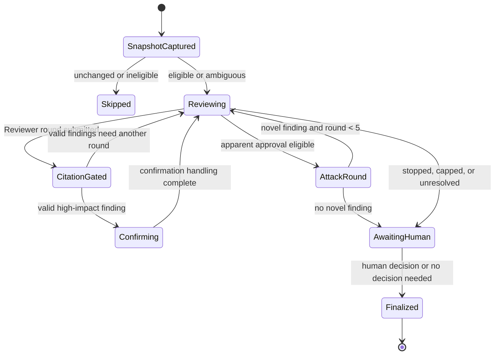
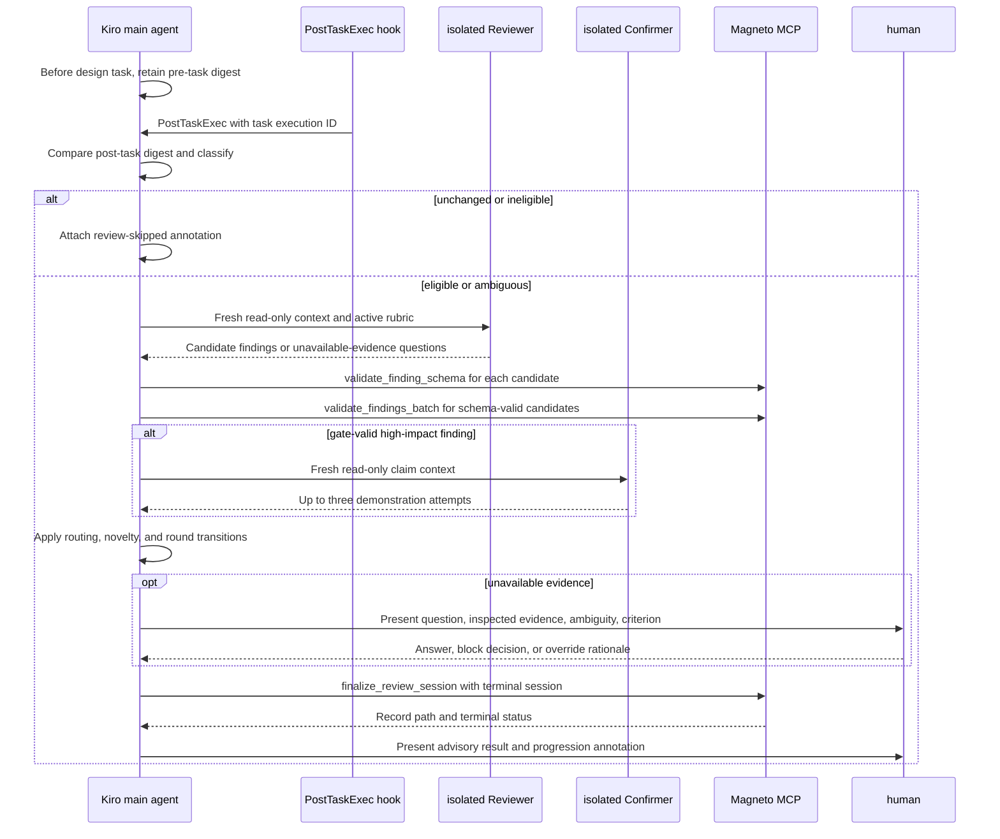

# Adversarial Review Operational Workflow Design

## Overview

The Adversarial_Review_Operational_Workflow turns the existing deterministic Magneto primitives into an advisory, Kiro-native review protocol for a changed Kiro Spec `design.md`. Kiro owns task lifecycle integration, change snapshots, isolated Reviewer and Confirmer invocations, human questions, and the decision to progress. Magneto remains a local, non-LLM stdio MCP server that validates citations and schemas and writes one terminal review record.

The boundary is intentionally asymmetric: Kiro subagents may propose findings and demonstrations but cannot validate their own evidence or mutate the reviewed artifact. Magneto accepts structured data, derives validation only from local files under `WORKSPACE_ROOT`, and finalizes a record. A review result is advisory; Kiro surfaces it to the human and records the human decision instead of autonomously blocking or editing a Spec.

The design preserves the existing `cmd/serve.go` stdio transport, the containment and 64 MiB read limit in `internal/citation`, the bounded state logic in `internal/session`, and the Markdown review output in `internal/output`. It closes the gap in the current `cmd/review.go`, which currently creates a session shell and finalizes immediately while assuming an external agent system drives the review loop.

## Goals and non-goals

### Goals

* Review only a changed `design.md` that is foundational, touches a configured blast-radius domain, or cannot be classified safely.
* Keep Reviewer and Confirmer contexts independent from author and each other, with read-only repository access.
* Store Criterion_Satisfaction, Finding_Severity, and Finding_Domain as separate concepts and route confirmation exclusively from severity and domain.
* Gate every candidate finding through deterministic schema and section-local quotation validation before approval or confirmation routing.
* Bound review to five Reviewer rounds and require one attack round before approval.
* Persist one complete or partial terminal record under `.kiro/reviews/` without changing the reviewed Spec or task artifacts.
* Preserve human control over unresolved findings, blocks, and overrides.

### Non-goals

* Magneto does not invoke LLMs, spawn Kiro subagents, infer citation validity, edit artifacts, or decide that a task may progress.
* Phase 1 does not collect a Phase 0 control baseline. Any future Phase 3 outcome comparison must state that no pre-Phase-1 baseline exists.
* The workflow does not add HTTP transport, a service daemon, or a persistent database.

## Existing implementation basis

The design extends these existing boundaries rather than replacing them:

* `cmd/serve.go` exposes Magneto only over MCP stdio and already requires `WORKSPACE_ROOT`.
* `cmd/tools.go` exposes deterministic citation and schema tools; `internal/citation/validate.go` resolves symlinks, enforces workspace containment, reads files in bounded chunks, extracts a heading or line range, and matches normalized whitespace.
* `internal/models/finding.go` currently has one `Score` field and a status enum; `internal/schema/validate.go` currently validates only the existing fields.
* `internal/session/round.go` already caps rounds and findings at five, performs novelty checks, and performs an attack-round transition. `internal/session/degradation.go` currently prevents a degraded session from becoming approved.
* `internal/prompt` provides isolated-context builders, but the Reviewer builder currently accepts prior finding text and the Confirmer builder lacks severity and domains. The new protocol narrows those inputs.
* `internal/output/filename.go` already produces `{spec-name}-{ISO-8601-date}-{sequence-number}.md` in `.kiro/reviews/`; `internal/output/markdown.go` already renders sessions.
* `.kiro/hooks/adversarial-review-trigger.json` currently detects only blast-radius language. The hook will become the Kiro entry point for the complete protocol.

## Architecture

### Responsibility boundary

* **Kiro hook and main agent:** captures the pre-task snapshot, compares post-task content, classifies eligibility, runs subagents, requests human input, and attaches advisory annotations. It does not edit the Design_Artifact, accept unsupported validation, or autonomously prevent progression.
* **Reviewer subagent:** evaluates active rubric criteria, proposes up to five ordered findings, cites evidence, and identifies unavailable-evidence questions. It does not receive author context, change files, claim deterministic validation, or mark a finding confirmed.
* **Confirmer subagent:** independently attempts up to three demonstrations for a selected high-impact claim. It does not receive Reviewer reasoning or intermediate output, change files, or validate citations.
* **Magneto MCP server:** normalizes and validates finding schemas, validates citations, enforces final terminal status, and renders and persists records. It does not invoke agents, interpret prose semantically, access files outside `WORKSPACE_ROOT`, or control Kiro progression.
* **Human:** answers unavailable-evidence questions, accepts a block, continues with risk, or overrides with rationale.

### Workflow state model

Kiro maintains ephemeral session state until terminal finalization. A skipped selection is recorded as a Kiro task annotation, not as a Review_Session. A Review_Session that has started is finalized exactly once after all required review work and applicable human decisions finish.



`AwaitingHuman` is not a terminal state. It retains only Kiro-managed in-memory session data so an escalation answer, accepted block, or override can be included in the single terminal Review_Record. If Kiro cannot retain that state, it records a required-component failure and finalizes any available data as `partial_review` when possible.

### Trigger and snapshot protocol

Immediately before a Kiro design task starts, the main agent records an in-memory snapshot keyed by Kiro task execution ID and canonical Design_Artifact path. The snapshot is a SHA-256 digest of the exact pre-task bytes plus the artifact path. It is not written into the Spec, task, or review directories.

At `PostTaskExec`, the hook resolves the Design_Artifact for the completed design task, reads current bytes through Kiro's read-only workspace facility, and compares the digest with the matching pre-task snapshot.

* Equal digests produce `review-skipped` with `unchanged` and an annotation containing the path and reason.
* A changed artifact is classified using `internal/trigger.Classify` inputs populated from deterministic design metadata. A foundational artifact or one or more configured blast-radius domains starts exactly one session.
* A changed artifact that meets all skip conditions produces `review-skipped` with the classifier reason.
* A missing snapshot, conflicting stored selection result, malformed design metadata, or unavailable classification evidence is `ambiguous`; it starts exactly one session and records the ambiguity reason.
* If selection, session initialization, or its Kiro annotation cannot be persisted, the hook emits `review-trigger-failed` to the human, continues the Kiro workflow, and records the failure in a terminal record if finalization is later available.

The hook configuration remains a `PostTaskExec` agent hook. Its prompt is revised to require the snapshot comparison first, then invoke the Kiro review coordinator only for a changed eligible or ambiguous artifact. Domain detection does not replace the existing `trigger.Classify` decision; it supplies its artifact metadata.

### Detailed interaction flow



The Reviewer repeats only while the round manager is active and fewer than five ordinary rounds have executed. Kiro supplies the active rubric criteria and a deterministic prior-failure fingerprint set, never prior Reviewer reasoning. The fingerprint contains criterion name, canonical Criterion_Satisfaction, and a normalized evidence hash; it is enough to focus a new pass without revealing authored rationale. Kiro runs an Attack_Round exactly once when every active criterion has a gate-valid satisfaction of 7 through 10. A novel attack finding returns the manager to ordinary rounds if the cap permits it. No novel attack finding makes approval eligible, subject to required-component and human-decision rules.

## Components and interfaces

### Kiro review coordinator

The Kiro main agent is the coordinator. It owns transient state and invokes Reviewer and Confirmer through Kiro's isolated-subagent mechanism. Each invocation is read-only and receives a capability manifest that allows only the Design_Artifact, explicitly referenced paths, repository search, and Magneto's MCP tools. It never receives shell, write, edit, task execution, deployment, or network capabilities.

The coordinator creates one Reviewer invocation per round. Its input contains the canonical artifact path, active rubric content, round number, allowed repository paths, and opaque prior-failure fingerprints. It does not contain author chat history, reasoning, self-assessments, previous findings, prior finding reasoning, human answers unrelated to the active criterion, or Confirmer output.

For each selected target, the coordinator creates a new Confirmer invocation with a Kiro identity different from the author identity. Its input contains only claim text, criterion name, artifact path, section reference, quoted excerpt, Finding_Severity, Finding_Domain values, the attempt number, and allowed repository paths. It excludes Reviewer reasoning, intermediate output, other findings, author context, and all mutable capabilities.

Reviewer and Confirmer outputs are untrusted structured proposals. The coordinator rejects a candidate that asserts `confirmed`, `citation_valid`, a gate result, or an undeclared field. The coordinator alone passes the normalized proposal to Magneto and applies Magneto responses.

### Reviewer output contract

The Reviewer returns at most five candidate findings, sorted by severity in this fixed order: `critical`, `high`, `medium`, `low`. It also returns zero or more Human_Escalation proposals. Every active criterion receives exactly one final finding in the session; a criterion for which available evidence is insufficient receives satisfaction `1`, a citation to the inspected missing or absent evidence location where possible, and `unconfirmed` after gate processing.

```json
{
  "findings": [
    {
      "criterion_name": "Path containment",
      "criterion_satisfaction": 4,
      "finding_severity": "high",
      "finding_domains": ["security", "correctness"],
      "quoted_excerpt": "The server resolves the path under WORKSPACE_ROOT.",
      "artifact_location": {
        "file_path": ".kiro/specs/example/design.md",
        "section_reference": "Security"
      },
      "status": "hypothesized",
      "reasoning": "The design does not define symlink resolution before containment checking."
    }
  ],
  "escalations": []
}
```

The coordinator clamps `criterion_satisfaction` before storage. It does not use satisfaction to infer severity, domain, or confirmation routing.

### Confirmer output contract

The Confirmer returns one ordered attempt result for each invocation. A completed target has at most three attempts. Demonstration evidence must be a concrete counter-example, logical contradiction, failing test, or exploit description with a repository or artifact citation. Absence of such evidence is not evidence that the claim is false.

```json
{
  "attempt": 2,
  "strategy": "Trace symlink resolution through the referenced validation path.",
  "observation": "The design omits resolution before prefix comparison.",
  "demonstration_evidence": "A symlink under the workspace can resolve outside the workspace.",
  "demonstrated": true
}
```

For a gate-valid high-impact finding, a demonstration sets status to `confirmed` and ends attempts. No demonstration before final determination retains `hypothesized`. After three attempts without a demonstration, status becomes `unconfirmed`. Attempt-detail persistence is optional: a persistence failure never changes `confirmed` or the final three-attempt `unconfirmed` result.

### Magneto MCP surface

Magneto retains its `serve` command and MCP stdio transport. Existing callers may continue to call `validate_citation`, `validate_findings_batch`, and `validate_finding_schema`; their successful responses gain additive fields only. Kiro is the only caller of the new finalization tool.

| Surface                   | Change                    | Request responsibility                                                                         | Response responsibility                                                                                                            |
|---------------------------|---------------------------|------------------------------------------------------------------------------------------------|------------------------------------------------------------------------------------------------------------------------------------|
| `validate_finding_schema` | Extend                    | Accept canonical finding fields and optionally legacy `score` during migration                 | Return `valid`, field errors, and the normalized canonical finding including clamped satisfaction                                  |
| `validate_citation`       | Preserve                  | Validate one quoted excerpt, relative path, and heading or line range                          | Return deterministic validity, failure reason, and matched line range                                                              |
| `validate_findings_batch` | Extend input adapter only | Validate canonical findings after schema validation                                            | Return index-aligned deterministic citation results; no status decision                                                            |
| `finalize_review_session` | Add                       | Receive a terminal `ReviewSessionOutput` plus selection metadata and unavailable-value reasons | Enforce terminal invariants, render one record, persist it, and return record path, terminal status, and warnings                  |
| `magneto review`          | Compatibility wrapper     | Continue accepting its current artifact arguments                                              | Remain non-interactive; emit a deprecation notice directing Kiro-native orchestration to MCP finalization, without invoking agents |

`finalize_review_session` is the finalization surface. It accepts no artifact content and does not reread paths except through citation results already supplied by the deterministic tools. It accepts a session only when `terminal_status` is one of `approved`, `not_approved`, `partial_review`, or `human_override`. It writes exactly one record through `output.GenerateFilename` and `output.RenderSession`. A Kiro retry uses an idempotency key composed from task execution ID and terminal-session ID; the finalizer returns the original record path for the same key instead of creating a second record.

The finalizer rejects LLM-derived gate claims by design: no request field can assert citation validity, schema validity, or confirmation status. It accepts only responses correlated to a Magneto tool invocation for the same session and finding index. Missing or mismatched provenance is a deterministic gate failure, is recorded as `unconfirmed`, and cannot route to a Confirmer or satisfy approval eligibility.

### Prompt-builder changes

`internal/prompt/reviewer.go` changes its input from free-form `PriorFindings` to opaque `PriorFailureFingerprints` and removes all prior rationale from rendered context. `internal/prompt/confirmer.go` adds `FindingSeverity`, `FindingDomains`, and `AttemptNumber`, while retaining only claim-local evidence. `internal/prompt/attack.go` receives the same fingerprint-only prior context and an explicit attack focus selected by the coordinator. These changes preserve the existing builders while making the isolation contract auditable by unit tests.

### Required and optional component semantics

| Component or operation                                      | Classification                                                                                     | Failure effect                                                                                                                                                 |
|-------------------------------------------------------------|----------------------------------------------------------------------------------------------------|----------------------------------------------------------------------------------------------------------------------------------------------------------------|
| Pre-task snapshot comparison and eligibility classification | Required before a clean selection; ambiguous fallback is available                                 | Start one ambiguous session when comparison or classification is incomplete; warn and continue only if a session cannot start                                  |
| Rubric loading                                              | Required for active criteria                                                                       | Degrade affected criteria and prevent `approved`                                                                                                               |
| Reviewer invocation and read access to an active criterion  | Required                                                                                           | Degrade affected criteria; continue independent readable criteria; prevent `approved`                                                                          |
| Citation_Gate schema and citation validation                | Required                                                                                           | Mark affected findings `unchecked (gate unavailable)`, show them to the human, and prevent `approved`                                                          |
| Confirmer invocation                                        | Conditionally required for each gate-valid High_Impact_Finding; not required when no target exists | Degrade the session and prevent `approved` if a required target cannot complete; non-target findings do not invoke a Confirmer                                 |
| Human escalation response                                   | Required only for a dependent criterion to resume                                                  | Continue independent work and wait in `AwaitingHuman`; no terminal approval while unresolved                                                                   |
| Final record writer                                         | Required for durable completion, advisory for Kiro progression                                     | Notify the human and continue Kiro with `review-trigger-failed` if no record can be written; retain the in-memory terminal result only for that Kiro execution |
| Confirmer attempt-detail persistence                        | Optional                                                                                           | Preserve confirmed or final unconfirmed status and record the optional failure when a record is available                                                      |
| Phase 3 baseline metadata and comparative analytics         | Optional                                                                                           | Do not affect review outcome; any generated analysis labels baseline absence                                                                                   |

A `DegradationEntry` gains a `criticality` value of `required` or `optional`, plus an optional unavailable-value key. `AllowedTerminalStatus` changes from “any degradation blocks approval” to “required degradation blocks approval.” This implements the requirement that optional failures permit approval evaluation while preserving the invariant that a required failure cannot result in `approved`. A human override still yields `human_override`, retains all degradation entries, and requires a non-empty rationale.

## Data models

### Canonical finding model

The existing `Score` field is replaced as the canonical wire and model concept by `CriterionSatisfaction`. The migration adapter accepts legacy JSON `score`, maps it once to `criterion_satisfaction`, clamps it, and never emits `score` in newly rendered records. This is the smallest compatibility layer that prevents two persisted meanings for the same value.

```text
CriterionSatisfaction: integer in [1, 10]
FindingSeverity: critical | high | medium | low
FindingDomain: security | correctness | architecture | reliability | operations | developer-experience
FindingStatus: hypothesized | confirmed | unconfirmed | unconfirmed (inconclusive) | unchecked (gate unavailable)
ComponentCriticality: required | optional
```

`ReviewFinding` gains `CriterionSatisfaction`, `FindingSeverity`, `FindingDomains`, `CitationGateResult`, and `ConfirmerAttempts`. It retains `CriterionName`, `QuotedExcerpt`, `ArtifactLocation`, `Status`, `Reasoning`, and `ConfirmerEvidence`. `FindingDomains` is a non-empty set serialized as a duplicate-free array in stable enum order. `CitationGateResult` records deterministic schema outcome, deterministic citation outcome, failure reason, matched lines when available, and provenance correlation ID. `ConfirmerAttempts` is omitted for non-target findings and when optional attempt-detail persistence fails.

Schema normalization occurs before any storage:

1. Map a legacy `score` only if canonical `criterion_satisfaction` is absent.
2. Clamp satisfaction below 1 to 1 and above 10 to 10.
3. Reject missing criterion name, severity, status, reasoning, quote, location, or domain set.
4. Reject severity outside the four-value enum and a domain set that is empty, contains an invalid value, or repeats a value.
5. Preserve a proposed status only as `hypothesized`; the coordinator and finalizer own all other status transitions.

### Session and record model

`SessionMetadata` gains the task execution ID, session ID, selection decision, selection reason, ambiguity flag, triggered blast-radius domains, foundational classification, loaded rubric criterion names, attack-round execution result, and a `phase_3_baseline` marker set to `absent`. `ReviewSessionOutput` gains `HumanBlockAcceptance`, `UnavailableValues`, and terminal idempotency metadata. Each unavailable value is `{field, reason}` and is rendered only in `partial_review` records.

`HumanEscalation` gains `InspectedEvidence` and `RemainingAmbiguity`. `HumanOverride` gains an explicit decision value, while block acceptance is represented separately so an override and an accepted block cannot be conflated. Both require non-empty rationale before finalization.

The record includes all available metadata and findings, then conditionally includes human events, unavailable values, and degradation entries. It always labels Phase 3 analysis as lacking a pre-Phase-1 control baseline. It never creates an interim review record: partial records are terminal-only and list unavailable values with their reasons rather than implying that a later write will complete them.

### Selection and routing predicates

The following predicates are implemented as pure session functions and reused by Kiro orchestration tests and Magneto finalization validation.

```text
HighImpact(finding) =
  finding.severity == critical OR
  (finding.severity == high AND
   (security IN finding.domains OR correctness IN finding.domains))

ConfirmerTarget(finding) = GateValid(finding) AND HighImpact(finding)

ApparentApproval(findings) =
  every active criterion has exactly one finding AND
  every finding.satisfaction IN [7, 10] AND
  every finding has a valid Citation_Gate result AND
  no required component has failed
```

Severity and domain are never calculated from Criterion_Satisfaction. An invalid or gate-unavailable finding is excluded from `ConfirmerTarget` and makes `ApparentApproval` false. Only a valid target with demonstrated evidence may transition from `hypothesized` to `confirmed`.

## Correctness properties

A property is a characteristic or behavior that should hold true across all valid executions of a system—essentially, a formal statement about what the system should do. Properties bridge human-readable specifications and machine-verifiable correctness guarantees.

Property reflection consolidated equivalent checks before defining tests. The target-selection predicates from Requirements 3.5, 5.1, and 5.8 are one property because membership and exclusion are complements. The status-transition requirements from 4.3, 4.4, and 5.2 through 5.6 are one complete state property. The five-round, novelty, attack-round, cap, and per-round limit rules are one state-machine property. Validation-source architecture and Kiro capability boundaries remain integration checks rather than artificial properties.

### Property 1: Changed eligible selections start exactly once

For any pre-task and post-task artifact pair with deterministic classification metadata, a changed foundational or blast-radius artifact, an ambiguous classification, or a changed-versus-recorded-skip conflict produces exactly one Review_Session; an unchanged or deterministically ineligible artifact produces no Review_Session.

_Validation targets: Requirements 1.2, 1.3, 1.7._

### Property 2: Identity-safe role selection and evidence scoring

For any author identity, eligible Confirmer identity set, active rubric criteria, and evidence availability outcomes, the selected Confirmer differs from the author and stored findings contain exactly one clamped Criterion_Satisfaction per active criterion, with unavailable evidence mapped to 1 and clear evidence mapped to 2 through 10.

_Validation targets: Requirements 2.4, 2.6, 2.7, 3.1, 3.2._

### Property 3: Finding dimensions remain valid and independent

For any proposed findings, normalization produces a Criterion_Satisfaction in 1 through 10, exactly one valid Finding_Severity, and a duplicate-free non-empty set of valid Finding_Domain values without deriving severity or domains from satisfaction.

_Validation targets: Requirements 3.1, 3.3, 3.4._

### Property 4: Confirmation targets match the impact predicate

For any gate outcomes and valid findings, the coordinator selects every and only gate-valid critical finding, plus every and only gate-valid high finding whose domains include security or correctness; it selects no other finding for Confirmer invocation.

_Validation targets: Requirements 3.5, 5.1, 5.8._

### Property 5: Gate and confirmation transitions cannot create unsupported confirmation

For any finding, schema result, citation result, validation provenance, and Confirmer attempts, an invalid, non-deterministically sourced, or unavailable gate result yields `unconfirmed` or `unchecked (gate unavailable)` and blocks routing and approval; a gate-valid high-impact finding becomes `confirmed` only with demonstration evidence, remains `hypothesized` before final determination without evidence, and becomes `unconfirmed` after three unsuccessful attempts regardless of optional attempt-detail persistence.

_Validation targets: Requirements 3.6, 4.3, 4.4, 4.6, 5.2, 5.3, 5.5, 5.6._

### Property 6: Normalized quotation matching is invariant under whitespace variation

For any quoted excerpt and cited section that differ only by runs of whitespace, deterministic citation validation returns the same successful match result as validation of the original text.

_Validation targets: Requirements 4.2._

### Property 7: Review state remains bounded and challenges approval

For any sequence of normalized Reviewer and Attack_Round findings, no session accepts more than five findings per round or executes more than five Reviewer rounds; a non-novel ordinary round stops, all gate-valid scores of 7 through 10 require one attack round before approval, a novel attack result resumes ordinary rounds below the cap, and exhaustion without approval yields `not_approved`.

_Validation targets: Requirements 6.1, 6.2, 6.3, 6.4, 6.5, 6.6._

### Property 8: Human decisions and terminal records preserve available information

For any non-empty human rationale, degradation entries, unavailable-value reasons, and terminal session data, finalization preserves every available finding and human decision, emits each unavailable value with its reason only in a terminal partial record, generates one unique record filename, and rejects an empty override or block rationale.

_Validation targets: Requirements 7.8, 8.1, 8.3, 8.4, 8.7, 9.1, 9.5._

### Property 9: Required degradation prevents approval while optional degradation does not

For any proposed terminal status and mixture of required and optional component failures, a required failure without a human override cannot finalize as `approved` and finalizes as `partial_review`; optional failures alone preserve approval evaluation, while a non-empty human override rationale finalizes as `human_override` and retains all degradation details.

_Validation targets: Requirements 9.3, 9.4, 9.5, 9.6._

## Error handling

### Gate and proposal errors

Schema failure, invalid enum values, missing citation fields, invalid citation locations, unmatched excerpts, invalid validation provenance, and malformed candidate payloads do not abort unrelated criteria. The coordinator records the failure in `CitationGateResult`, sets the finding to `unconfirmed`, and excludes it from confirmation routing and apparent approval. A Citation_Gate transport failure is different: it creates a required degradation entry and sets affected findings to `unchecked (gate unavailable)`.

### Agent and access errors

A Reviewer failure, rubric-load failure, denied access to a Design_Artifact, or a required Confirmer failure creates a required degradation entry containing component, criticality, failure mode, timestamp, and affected criteria. Kiro continues independent criteria when safe. A Confirmer result without demonstration is a normal verification outcome, not a component failure. Attempt-detail write failure is optional and does not alter the final claim status.

When a reviewer identifies a question that available artifact, repository, and deterministic-tool evidence cannot resolve, Kiro creates Human_Escalation and presents the exact question, inspected evidence, remaining ambiguity, and criterion. It resumes only the dependent work after an answer, while independent criteria continue. The Reviewer must resolve evidence-available questions rather than escalating them.

### Trigger and persistence errors

If a pre-task snapshot is unavailable, the hook starts an ambiguous session. If session initialization or selection-reason persistence fails, the hook reports `review-trigger-failed` and allows the design workflow to continue. If final record persistence fails, Kiro presents the result and an explicit warning; it does not retry by fabricating a record or modify the reviewed artifact. A completed terminal session with available persistence always writes one record; retries use the session idempotency key.

### Terminal status precedence

Finalization applies this precedence in order: a valid human override produces `human_override`; otherwise a required degradation produces `partial_review`; otherwise attack-round success produces `approved`; otherwise the result is `not_approved`. A human-accepted block is stored as a human decision and causes Kiro to prevent task progression, but the review record retains its evidence-based terminal status unless it is also an override. Kiro allows progression with `review-unresolved` when unresolved findings remain and the human has not accepted a block.

## Security and containment

The workflow retains Magneto's security invariants: MCP has stdio transport only, citation paths are relative to `WORKSPACE_ROOT`, symlinks are resolved before containment validation, and user-controlled files are read in 1 MiB chunks with a 64 MiB hard limit. The finalizer uses `filepath.Join` and the existing filename generator for review record placement.

Kiro limits the Reviewer and Confirmer to read-only file and search capabilities. The capability manifest is allowlisted per invocation rather than relying on prompt instruction. No subagent receives write, shell, network, deployment, source-control mutation, or secret-management capabilities. The prompt context references only permitted repository paths; a request for an unlisted path is rejected by the coordinator and recorded as unavailable evidence or degradation as appropriate.

Prompt injection resistance comes from treating artifact and repository content as evidence, not instructions. Artifact text cannot alter Kiro role permissions, route around Magneto validation, declare a citation valid, or add MCP tools. The correlation IDs in Citation_Gate results bind a validation result to the current session and finding index, preventing an agent from replaying or inventing a prior result.

Review records may contain repository evidence and human rationale. They use the existing workspace-local `.kiro/reviews/` path and must not include author chat history, Reviewer hidden reasoning, Confirmer hidden reasoning, or secret values. If evidence would expose a secret, the Reviewer cites the structural location and redacts the value before submitting the finding; deterministic citation matching uses the unredacted excerpt only when it is safe to retain locally, otherwise the finding is routed to Human_Escalation as unavailable safe evidence.

## Testing strategy

Property-based testing applies to the pure normalization, routing, state-machine, degradation, and render-preservation logic. Go tests use the repository's existing `pgregory.net/rapid` library and run at least 100 iterations per property. Each property test carries a comment in this form: `Feature: adversarial-review-operational-workflow, Property N: <property title>`. Each property has one property test, with generators covering empty and repeated domains, all score bounds, invalid values, conflicting selection state, mixed component criticality, round caps, and optional persistence failures.

Example-based unit tests cover snapshot equality, ambiguous selection, prompt field exclusion, capability manifests, all enum validation errors, human escalation presentation, legacy `score` decoding, rendered omission of absent human events, Phase 3 baseline labeling, and stable record naming. State-machine tests extend the existing `internal/session` tests without duplicating rapid properties.

Integration tests use mocked Kiro subagent invocation and a temporary workspace. They verify Reviewer and Confirmer manifests are read-only, forbidden context is absent, only an author-distinct Confirmer is selected, artifact writes never occur, and Magneto's real stdio handlers perform schema and citation validation. Citation integration tests retain path-traversal, symlink-escape, oversized-file, section-heading, line-range, and whitespace-normalization coverage. No property test invokes Kiro or external services.

Finalization integration tests use `t.TempDir()` and verify terminal-only record creation, idempotent retry return of the original path, required-versus-optional degradation behavior, unavailable-value rendering, human decision rendering, and no writes outside `.kiro/reviews/`. The full Go suite remains `go test ./...`; Markdown changes are checked with `rumdl check`.

## Acceptance requirement traceability

| Requirements | Design coverage                                                                                            | Primary verification                                                        |
|--------------|------------------------------------------------------------------------------------------------------------|-----------------------------------------------------------------------------|
| 1.1–1.7      | Trigger and snapshot protocol; workflow state model; trigger and persistence errors                        | Snapshot unit tests, selection Property 1, hook integration tests           |
| 2.1–2.7      | Responsibility boundary; Kiro review coordinator; Reviewer and Confirmer contracts; prompt-builder changes | Context and capability integration tests, Property 2                        |
| 3.1–3.6      | Canonical finding model; selection and routing predicates; MCP schema extension                            | Properties 2–5 and schema unit tests                                        |
| 4.1–4.6      | Magneto MCP surface; gate and proposal errors; security and containment                                    | Properties 5–6, real handler integration tests                              |
| 5.1–5.8      | Confirmer output contract; required and optional semantics; terminal status precedence                     | Properties 4–5 and confirmation integration tests                           |
| 6.1–6.6      | Workflow state model; detailed interaction flow; bounded-review property                                   | Property 7 and round-manager tests                                          |
| 7.1–7.8      | Responsibility boundary; awaiting-human state; error handling; terminal status precedence                  | Human-decision unit tests and read-only integration tests                   |
| 8.1–8.7      | Session and record model; finalization surface; terminal-only partial records                              | Property 8 and output/finalization integration tests                        |
| 9.1–9.8      | Required and optional component semantics; error handling; terminal status precedence                      | Property 9, degradation unit tests, and failure-injection integration tests |

## Migration and compatibility plan

1. Add the canonical finding enums and fields, schema normalization, gate provenance result, degradation criticality, unavailable values, and record rendering before changing Kiro orchestration. Keep `score` accepted only at the MCP input adapter and document it as deprecated.
2. Extend existing MCP tool responses additively so present clients that read `valid`, error text, or citation results continue to work. Preserve existing tool names and stdio transport.
3. Add `finalize_review_session` and use it only from the revised Kiro hook and coordinator. Keep `magneto review` non-interactive as a compatibility wrapper; it neither invokes subagents nor claims to run the full Kiro-native workflow.
4. Revise Kiro prompt builders and hook configuration together so no invocation can receive prior reasoning or write capability. Roll out behind the existing hook, which remains advisory and does not change task execution semantics.
5. Add session-idempotent finalization and record-format tests before enabling the hook for all design tasks. Existing review records remain readable because new sections are additive; new records use canonical Criterion_Satisfaction and include a migration marker when a legacy score was received.
6. After callers adopt canonical fields, remove legacy `score` decoding in a separately announced breaking release. Do not remove historical record rendering support.

No essential product decision remains unspecifiable. The design resolves the required ownership boundary, confirmation predicate, terminal behavior, persistence timing, component criticality, and compatibility path from the approved requirements and current implementation.
