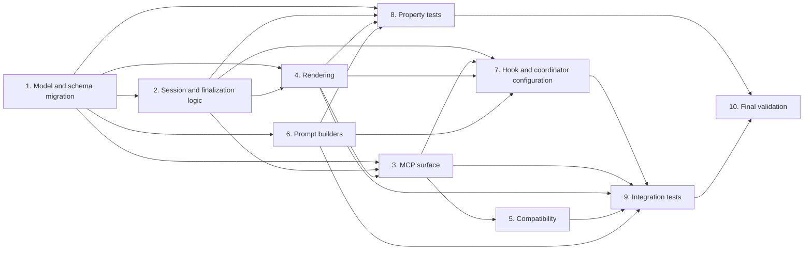

# Implementation Plan for Adversarial Review Operational Workflow

## Overview

Extend the completed `adversarial-review-agent` foundation into the approved Kiro-native operational workflow. This plan deliberately changes existing Phase 1 primitives only where the operational design requires canonical finding dimensions, deterministic session finalization, isolated Kiro coordination, terminal-only records, and compatibility behavior. It does not recreate the existing citation containment, base schema validation, novelty detection, trigger classifier, MCP stdio transport, or initial hook and steering assets.

## Completed foundation excluded from this plan

The completed `adversarial-review-agent` plan already created the base `internal/citation`, `internal/schema`, `internal/novelty`, `internal/trigger`, `internal/session`, `internal/output`, `internal/prompt`, `cmd/serve.go`, `cmd/tools.go`, `cmd/review.go`, and `.kiro/hooks/adversarial-review-trigger.json` implementations. The tasks below make only the intentional operational-workflow changes described in the approved design.

## Tasks

* [x] 1. Migrate the canonical finding and session models
  * [x] 1.1 Replace the canonical `Score` concept with `CriterionSatisfaction`, add severity, domains, citation-gate provenance, confirmer attempts, component criticality, unavailable values, and selection metadata in `internal/models/finding.go` and `internal/models/session.go`.
    * Preserve the existing finding identity, citation location, status, reasoning, and confirmer evidence fields.
    * Encode finding domains as duplicate-free arrays in stable enum order and add the approved terminal, selection, and human-decision fields.
    * _Requirements: 3.1–3.4, 4.1, 5.3, 7.8, 8.2–8.7, 9.1, 9.5_
  * [x] 1.2 Extend `internal/schema/validate.go` to normalize canonical findings before storage: map legacy `score` only when `criterion_satisfaction` is absent, clamp satisfaction to 1 through 10, validate enum values and distinct non-empty domains, and reject non-hypothesized proposed statuses.
    * Keep deterministic structured field errors and prohibit request-provided gate, confirmation, or provenance assertions.
    * _Requirements: 3.1–3.4, 4.1, 4.3–4.6_
  * [x] 1.3 Add focused migration and schema unit tests in `internal/schema/validate_test.go` and `internal/schema/validate_property_test.go`.
    * Cover legacy-score decoding, canonical-field precedence, both clamp boundaries, invalid severity and domain sets, duplicate domains, missing fields, and prohibited proposed statuses.
    * _Requirements: 3.1–3.4, 4.1, 4.3, 4.6_

* [x] 2. Implement operational session routing and terminal-state logic
  * [x] 2.1 Add pure selection, confirmation-target, apparent-approval, and finding-status transition functions in `internal/session/routing.go`.
    * Select confirmer targets only for gate-valid critical findings and gate-valid high findings with `security` or `correctness` domains; never derive impact from satisfaction.
    * Enforce gate failures, unavailable gates, evidence-backed confirmation, three unsuccessful attempts, and exclusion of unsupported findings from routing and approval.
    * _Requirements: 3.5–3.6, 4.3–4.4, 5.1–5.8_
  * [x] 2.2 Update `internal/session/round.go`, `internal/session/citation_downgrade.go`, and `internal/session/degradation.go` for the approved workflow semantics.
    * Preserve the existing five-round and five-findings-per-round limits while requiring one attack round before approval, supporting a novel attack round return, and retaining criterion-level evidence outcomes.
    * Change degradation handling so required failures prevent `approved`, optional failures remain auditable without automatically blocking approval evaluation, and a valid human override produces `human_override`.
    * _Requirements: 4.3–4.4, 5.2–5.7, 6.1–6.6, 9.1–9.8_
  * [x] 2.3 Add terminal-session finalization validation in `internal/session/finalize.go`.
    * Accept only approved terminal statuses, enforce terminal-status precedence, validate non-empty override and block rationales, carry unavailable-value reasons only for `partial_review`, and produce idempotency data from task execution ID and session ID.
    * _Requirements: 7.6–7.8, 8.1, 8.4–8.7, 9.4–9.6_
  * [x] 2.4 Add session unit tests in `internal/session/round_test.go`, `internal/session/citation_downgrade_test.go`, `internal/session/degradation_test.go`, and new `internal/session/routing_test.go` and `internal/session/finalize_test.go`.
    * Cover high-impact routing, non-target exclusion, three-attempt outcomes, attack-round transitions, required versus optional degradation, status precedence, and rationale validation.
    * _Requirements: 3.5–3.6, 4.3–4.4, 5.1–5.8, 6.1–6.6, 7.8, 9.1–9.8_

* [x] 3. Extend deterministic MCP finalization and validation surfaces
  * [x] 3.1 Update `cmd/serve.go`, `cmd/tools.go`, and `cmd/errors.go` to add `finalize_review_session` and extend the three existing validation tools through additive canonical-field adapters.
    * Keep MCP on stdio and preserve `validate_citation`, `validate_findings_batch`, and `validate_finding_schema` names and existing success fields.
    * Correlate schema and citation results to session and finding index, reject missing or mismatched deterministic provenance, and ensure tool inputs cannot assert validation or confirmation outcomes.
    * _Requirements: 4.1–4.6, 8.1–8.7, 9.1–9.6_
  * [x] 3.2 After Task 4.1 establishes canonical terminal-record rendering, wire `finalize_review_session` through `internal/session/finalize.go`, `internal/output/filename.go`, and `internal/output/markdown.go` so each terminal idempotency key persists at most one record and returns the original path on retry.
    * Do not add agent invocation, artifact mutation, arbitrary path reads, or LLM-based validation to Magneto.
    * _Requirements: 4.5–4.6, 7.5, 8.1–8.7, 9.4–9.6_
  * [x] 3.3 Add real MCP handler integration tests in `cmd/serve_test.go` and `cmd/tools_test.go`.
    * Exercise canonical and legacy schema input, index-aligned batch responses, provenance rejection, terminal-status rejection, record idempotency, and write containment under a temporary workspace.
    * _Requirements: 3.1, 4.1–4.6, 8.1, 8.7, 9.4–9.6_

* [x] 4. Render the terminal operational review record
  * [x] 4.1 Update `internal/output/markdown.go` and `internal/output/filename.go` to render canonical satisfaction, severity, domains, deterministic gate outcomes, confirmation attempts or evidence, selection metadata, attack result, degradation details, and the absent Phase 3 baseline marker.
    * Render human escalation, override, and block-acceptance sections only when corresponding events exist.
    * Render unavailable values and reasons only for terminal `partial_review` records, without producing interim records.
    * _Requirements: 7.8, 8.1–8.7, 9.1, 9.4–9.5_
  * [x] 4.2 Extend `internal/output/output_test.go` with terminal-only output examples.
    * Verify record naming, Phase 3 baseline labeling, optional human-event omission, partial unavailable-value inclusion, complete finding preservation, and stable rendering of degradation information.
    * _Requirements: 8.1–8.7, 9.1, 9.4–9.5_

* [x] 5. Preserve the existing command and record compatibility boundary
  * [x] 5.1 Update `cmd/review.go` and `cmd/review_test.go` so `magneto review` remains non-interactive, emits the approved Kiro-native finalization deprecation notice, and never invokes subagents or claims to run the operational workflow.
    * Retain current artifact-argument behavior and ensure existing review records remain renderable while new records emit canonical satisfaction fields and a legacy-score migration marker when applicable.
    * _Requirements: 3.1, 4.5, 7.5, 8.1–8.7_
  * [x] 5.2 Add compatibility tests in `cmd/review_test.go` and `internal/output/output_test.go`.
    * Verify existing validation callers retain their successful response fields, legacy `score` is accepted only at the input adapter, and historical record sections remain readable.
    * _Requirements: 3.1, 4.1, 8.1–8.7_

* [x] 6. Narrow isolated Reviewer, Confirmer, and attack prompt inputs
  * [x] 6.1 Update `internal/prompt/reviewer.go`, `internal/prompt/confirmer.go`, and `internal/prompt/attack.go` to use only the approved role-local inputs.
    * Replace Reviewer and Attack prior-finding text with opaque prior-failure fingerprints.
    * Add Confirmer severity, domains, and attempt number while excluding Reviewer reasoning, intermediate outputs, author context, and mutable capabilities from every rendered context.
    * _Requirements: 2.1–2.7, 3.5, 5.1–5.4, 6.3–6.4_
  * [x] 6.2 Create `internal/prompt/reviewer_test.go`, `internal/prompt/confirmer_test.go`, and `internal/prompt/attack_test.go`.
    * Assert role-local fields are present, prohibited author and Reviewer fields are absent, and no prompt requests write, shell, network, deployment, or source-control capabilities.
    * _Requirements: 2.1–2.5, 7.5, 9.2_

* [x] 7. Configure the Kiro hook and operational coordinator protocol
  * [x] 7.1 After Task 6.1 establishes the isolated role-local prompts, update `.kiro/hooks/adversarial-review-trigger.json` and add `.kiro/steering/adversarial-review-operational-protocol.md` with the coordinator protocol defined by the approved design.
    * Require a pre-task digest keyed by task execution ID and canonical artifact path; on `PostTaskExec`, compare the post-task digest before classification.
    * Route unchanged and deterministically ineligible artifacts to advisory `review-skipped` annotations; route changed eligible, ambiguous, missing-snapshot, and selection-conflict artifacts to exactly one session.
    * Define the read-only capability manifest, author-distinct Confirmer selection, human escalation presentation, finalizer invocation, and non-blocking `review-trigger-failed` or `review-unresolved` annotations.
    * _Requirements: 1.1–1.7, 2.1–2.5, 6.1–6.5, 7.1–7.8, 9.1–9.8_
  * [x] 7.2 Add hook and coordinator configuration tests in `.kiro/hooks/adversarial-review-trigger_test.go` and `.kiro/steering/adversarial-review-operational-protocol_test.go`.
    * Use deterministic fixtures or parser checks to verify snapshot-first ordering, ambiguous fallback, one-session selection, read-only capability allowlists, author-distinct selection, and advisory continuation annotations.
    * _Requirements: 1.1–1.7, 2.1–2.5, 7.2–7.8, 9.2, 9.8_

* [x] 8. Add one property-based test per approved correctness property
  * [x] 8.1 Add Property 1 in new `internal/session/selection_property_test.go`: changed eligible, ambiguous, and conflicting selections start exactly one session; unchanged and ineligible selections start none.
    * **Property 1: Changed eligible selections start exactly once**
    * _Requirements: 1.2, 1.3, 1.7_
  * [x] 8.2 Add Property 2 in `internal/session/routing_property_test.go`: author-distinct Confirmer selection and clamped criterion satisfaction preserve the evidence-availability rules.
    * **Property 2: Identity-safe role selection and evidence scoring**
    * _Requirements: 2.4, 2.6, 2.7, 3.1, 3.2_
  * [x] 8.3 Add Property 3 in `internal/schema/validate_property_test.go`: normalization preserves independent valid satisfaction, severity, and domains.
    * **Property 3: Finding dimensions remain valid and independent**
    * _Requirements: 3.1, 3.3, 3.4_
  * [x] 8.4 Add Property 4 in `internal/session/routing_property_test.go`: Confirmer targets exactly match the gate-valid high-impact predicate.
    * **Property 4: Confirmation targets match the impact predicate**
    * _Requirements: 3.5, 5.1, 5.8_
  * [x] 8.5 Add Property 5 in `internal/session/routing_property_test.go`: gate and Confirmer transitions cannot produce unsupported confirmation.
    * **Property 5: Gate and confirmation transitions cannot create unsupported confirmation**
    * _Requirements: 3.6, 4.3, 4.4, 4.6, 5.2, 5.3, 5.5, 5.6_
  * [x] 8.6 Add Property 6 in `internal/citation/validate_property_test.go`: whitespace-only variation preserves deterministic successful citation matching.
    * **Property 6: Normalized quotation matching is invariant under whitespace variation**
    * _Requirements: 4.2_
  * [x] 8.7 Add Property 7 in `internal/session/round_property_test.go`: the review state remains bounded and requires an attack round before approval.
    * **Property 7: Review state remains bounded and challenges approval**
    * _Requirements: 6.1–6.6_
  * [x] 8.8 Add Property 8 in new `internal/output/markdown_property_test.go`: terminal finalization preserves available findings and human decisions, renders unavailable values only for partial records, and rejects empty rationales.
    * **Property 8: Human decisions and terminal records preserve available information**
    * _Requirements: 7.8, 8.1, 8.3, 8.4, 8.7, 9.1, 9.5_
  * [x] 8.9 Add Property 9 in `internal/session/degradation_property_test.go`: required degradation prevents approval, optional degradation preserves evaluation, and a valid override preserves degradations.
    * **Property 9: Required degradation prevents approval while optional degradation does not**
    * _Requirements: 9.3–9.6_
  * Each property test must use `pgregory.net/rapid`, run at least 100 iterations, and carry its exact `Feature: adversarial-review-operational-workflow, Property N: ...` test annotation.

* [x] 9. Verify the cross-boundary workflow with focused integration tests
  * [x] 9.1 After Tasks 6.1 and 7.1 complete, add `cmd/operational_workflow_integration_test.go` using a temporary workspace, mocked Kiro subagent invocations, and the real Magneto MCP handlers.
    * Verify a changed eligible design follows Reviewer, schema gate, citation gate, conditional Confirmer, state transition, and terminal finalization without artifact writes.
    * Verify unchanged and ineligible paths produce advisory skips; ambiguous classifications create a session; unavailable components produce partial review or required warning annotations; and human answers, accepted blocks, and overrides remain advisory and auditable.
    * _Requirements: 1.1–1.7, 2.1–2.7, 4.1–4.6, 5.1–5.8, 6.1–6.6, 7.1–7.8, 8.1–8.7, 9.1–9.8_
  * [x] 9.2 Extend existing citation integration coverage in `internal/citation/validate_test.go` for path traversal, symlink escape, oversized files, heading and line-range scope, and whitespace normalization after the MCP adapter changes.
    * _Requirements: 4.2, 4.5–4.6, 7.5_

* [x] 10. Final validation
  * [x] 10.1 Run `golangci-lint run --fix ./...`, `go vet ./...`, and `go test ./...`; resolve every reported diagnostic or test failure.
    * _Requirements: 1.1–9.8_
  * [x] 10.2 Run `rumdl check .kiro/hooks/adversarial-review-trigger.json .kiro/steering/adversarial-review-operational-protocol.md` when the Kiro coordinator configuration is added; resolve Markdown diagnostics before completion.
    * _Requirements: 1.1–1.7, 2.1–2.5, 7.1–7.8, 9.1–9.8_

## Task dependency graph

## Notes

* Tasks marked with `*` are test tasks and remain optional in the Kiro task UI; no task in this plan is complete.
* Execute tasks in dependency-graph order. Property and integration test tasks validate the implementation immediately before the final validation task.
* The plan changes no completed Phase 1 behavior unless the approved operational workflow explicitly requires the change.
