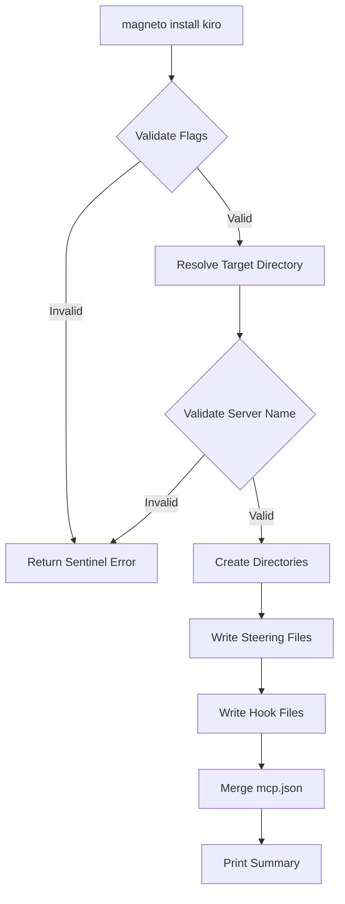

# Design Document

## Overview

The `magneto install kiro` command writes Kiro IDE integration files (steering, hooks, and MCP configuration) from the compiled binary to a target directory. It uses Go's `embed` package for zero-runtime-dependency file distribution, a JSON merge algorithm for non-destructive `mcp.json` updates, and follows the existing Cobra + fang CLI patterns established in the project.

The command introduces a two-level subcommand structure (`install` → `kiro`) to allow future install targets (e.g., `magneto install vscode`) without restructuring.

## Architecture



The installation flow is sequential and fail-fast. If any step fails, the command returns a wrapped sentinel error immediately without rolling back previously written files.

### Package layout

```text
cmd/
  install.go          → Parent "install" command (cobra.Command, init registration)
  install_kiro.go     → "kiro" subcommand (RunE, flag handling, orchestration)
  errors.go           → New sentinel errors added to existing var() block

internal/
  kirofiles/
    kirofiles.go      → embed.FS declaration, file listing, content access
    merge.go          → MCP config merge algorithm
    merge_test.go     → Property-based tests for merge logic
    validate.go       → Server name validation
    validate_test.go  → Property-based tests for validation
```

## Components and interfaces

### Cmd/install.go — Parent command

Registers the `install` parent command under `rootCmd`. Contains no `RunE` — Cobra automatically prints usage when invoked without a subcommand.

```go
var installCmd = &cobra.Command{
    Use:   "install",
    Short: "Install integration files for supported editors",
    Long:  clihelpers.LongHelpText(`...`),
}

func init() { // lint:allow_init
    rootCmd.AddCommand(installCmd)
}
```

### Cmd/install_kiro.go — Kiro subcommand

Owns flag definitions, input validation, and the orchestration function `runInstallKiro`. Flags:

| Flag                | Short | Type     | Default   | Description                    |
|---------------------|-------|----------|-----------|--------------------------------|
| `--workspace`       | —     | `bool`   | `false`   | Install to current working dir |
| `--user`            | —     | `bool`   | `false`   | Install to `$HOME`             |
| `--mcp-server-name` | `-S`  | `string` | `magneto` | Key name in mcpServers object  |

The `RunE` function:

1. Validates flag exclusivity (neither, both → error).
2. Resolves target directory (cwd or `$HOME`).
3. Validates target directory exists and is a directory.
4. Validates `--mcp-server-name` format.
5. Calls orchestration logic.

### Internal/kirofiles package

#### Kirofiles.go — Embed and file access

```go
//go:embed source/hooks/adversarial-review-trigger.json
//go:embed source/settings/mcp.json
//go:embed source/steering/adversarial-review-anti-patterns.md
//go:embed source/steering/adversarial-review-architecture-constraints.md
//go:embed source/steering/adversarial-review-rubric.md
var content embed.FS
```

The `source/` directory within `internal/kirofiles/` holds the canonical copies of the five files to embed. These explicit file patterns are committed to the repository and compiled into the binary; no directory is embedded. Consequently, files added later to `source/hooks/`, `source/settings/`, or `source/steering/` are not implicitly embedded or installed.

Exports:

* `Files() []string` — returns only the five fixed relative paths in deterministic order: `hooks/adversarial-review-trigger.json`, `settings/mcp.json`, `steering/adversarial-review-anti-patterns.md`, `steering/adversarial-review-architecture-constraints.md`, and `steering/adversarial-review-rubric.md`.
* `Content(path string) ([]byte, error)` — reads a single file from the embedded FS.
* `MCPTemplate() []byte` — returns the raw MCP server definition template.

#### Merge.go — MCP config merge

The `MergeMCPConfig` function encapsulates the merge algorithm:

```go
type MergeInput struct {
    Existing   []byte // nil means file does not exist
    ServerName string
    Definition json.RawMessage
}

type MergeResult struct {
    Output []byte // formatted JSON with trailing newline
}

func MergeMCPConfig(input *MergeInput) (*MergeResult, error)
```

**Algorithm:**

1. If `Existing` is nil or empty, construct a minimal `{"mcpServers": {<serverName>: <definition>}}` document.
2. Parse `Existing` into `map[string]json.RawMessage` (top-level keys).
3. If parsing fails, return `ErrMCPConfigParse`.
4. Extract the `mcpServers` value (or initialize empty object if absent).
5. Parse `mcpServers` into `map[string]json.RawMessage`.
6. Delete the key matching `ServerName` exactly.
7. Iterate remaining keys; delete any whose lowercase representation contains `"magneto"`.
8. Insert the new entry under `ServerName`.
9. Marshal `mcpServers` back, replace in the top-level map.
10. Marshal the full document with 2-space indent, append trailing newline.

The function is pure (no I/O) — it takes bytes in and returns bytes out. This makes it trivially testable with property-based tests.

#### Validate.go — Server name validation

```go
func ValidateServerName(name string) error
```

Validation rules:

* Must not be empty.
* Must start with a lowercase ASCII letter (`a-z`).
* Must contain only ASCII letters (`a-zA-Z`) and digits (`0-9`).
* No whitespace, hyphens, underscores, or special characters.

Returns `nil` on success or `ErrMCPServerNameInvalid` wrapped with a detail string on failure.

### Orchestration function

```go
type InstallKiroInput struct {
    TargetDir  string
    ServerName string
}

func runInstallKiro(input *InstallKiroInput) error
```

Steps:

1. Iterate `kirofiles.Files()`.
2. For each file, compute destination via `filepath.Join(input.TargetDir, ".kiro", relativePath)`.
3. Create intermediate directories with `os.MkdirAll(dir, 0o0755)`.
4. Write file content with `os.WriteFile(dest, content, 0o0666)`.
5. After all files are written, compute `mcp.json` path.
6. Read existing `mcp.json` (or nil if not found).
7. Call `kirofiles.MergeMCPConfig` with existing content, server name, and the embedded definition.
8. Write merged result to `mcp.json`.
9. Build summary output via `strings.Builder`.
10. Print summary to stdout.

If any write fails, return immediately with wrapped `ErrFileWrite` sentinel.

## Data models

### MCP configuration JSON structure

```json
{
  "mcpServers": {
    "magneto": {
      "command": "magneto",
      "args": ["serve"],
      "env": {
        "WORKSPACE_ROOT": "${workspaceFolder}"
      },
      "disabled": false
    }
  }
}
```

### Embedded file manifest

The embedded manifest contains exactly the five fixed source paths below. The layout mirrors the destination `.kiro/` structure, but it is not a directory-wide embed:

```text
internal/kirofiles/source/
  hooks/
    adversarial-review-trigger.json
  settings/
    mcp.json
  steering/
    adversarial-review-anti-patterns.md
    adversarial-review-architecture-constraints.md
    adversarial-review-rubric.md
```

`Files()` returns only `hooks/adversarial-review-trigger.json`, `settings/mcp.json`, `steering/adversarial-review-anti-patterns.md`, `steering/adversarial-review-architecture-constraints.md`, and `steering/adversarial-review-rubric.md`, in that order. The manifest comes solely from the five explicit embed patterns, so files later added beneath those source directories cannot be embedded or installed unless the manifest is deliberately changed.

The `settings/mcp.json` in the embed source is the template for the MCP server definition, not the full merged output. It contains only the Magneto server entry.

### Sentinel errors (additions to cmd/errors.go)

```go
// ErrFlagRequired indicates a required flag was not provided.
ErrFlagRequired = errors.New("required flag not provided")

// ErrFlagsMutuallyExclusive indicates mutually exclusive flags were both set.
ErrFlagsMutuallyExclusive = errors.New("mutually exclusive flags provided")

// ErrMCPConfigParse indicates the existing mcp.json contains invalid JSON.
ErrMCPConfigParse = errors.New("failed to parse MCP configuration file")

// ErrFileWrite indicates a file or directory write operation failed.
ErrFileWrite = errors.New("failed to write file")

// ErrMCPServerNameInvalid indicates the MCP server name does not conform
// to naming conventions.
ErrMCPServerNameInvalid = errors.New("invalid MCP server name format")
```

## Correctness properties

_A property is a characteristic or behavior that should hold true across all valid executions of a system — essentially, a formal statement about what the system should do. Properties serve as the bridge between human-readable specifications and machine-verifiable correctness guarantees._

### Property 1: MCP merge preserves non-Magneto entries

_For any_ valid `mcp.json` containing an `mcpServers` object with arbitrary non-Magneto keys, after merging with any valid server name, all non-Magneto entries in `mcpServers` SHALL be byte-identical to their pre-merge values, and all top-level keys outside `mcpServers` SHALL be preserved unchanged.

**Validates:** Requirements 5.5, 5.6

### Property 2: MCP merge removes all Magneto-related keys and adds the new entry

_For any_ valid `mcp.json` containing an `mcpServers` object with keys that contain the case-insensitive substring "Magneto", after merging with a valid server name `S`, the output SHALL contain exactly one key matching `S` in `mcpServers`, and no other key in `mcpServers` SHALL contain the case-insensitive substring "Magneto".

**Validates:** Requirements 5.3, 5.4

### Property 3: MCP merge output formatting

_For any_ input to the merge function that does not produce an error, the output bytes SHALL be valid JSON with 2-space indentation and SHALL end with exactly one newline character (`\n`).

**Validates:** Requirements 5.7

### Property 4: MCP merge idempotence

_For any_ valid merge input, applying the merge function to its own output (with the same server name and definition) SHALL produce byte-identical output — `merge(merge(input)) == merge(input)`.

**Validates:** Requirements 7.1

### Property 5: Server name validation accepts only valid names

_For any_ string `s`, `ValidateServerName(s)` returns nil if and only if `s` is non-empty, starts with a lowercase ASCII letter, and contains only ASCII letters and digits. For all other strings, it returns an error wrapping `ErrMCPServerNameInvalid`.

**Validates:** Requirements 10.3, 10.4

### Property 6: Fixed manifest scope and file content integrity

_For any_ target directory state, including arbitrary pre-existing content and missing parent directories, `Files()` SHALL return exactly these five paths in deterministic order: `hooks/adversarial-review-trigger.json`, `settings/mcp.json`, `steering/adversarial-review-anti-patterns.md`, `steering/adversarial-review-architecture-constraints.md`, and `steering/adversarial-review-rubric.md`. Installation SHALL write only files from that manifest, and each written file SHALL contain bytes identical to its embedded source content; no additional file from an embedded source directory can be embedded or installed.

**Validates:** Requirements 3.1, 3.2, 4.1, 4.2, 4.3

## Error handling

All errors follow the project's sentinel + wrap pattern. The command returns the first error encountered without attempting recovery or rollback.

| Condition                                   | Sentinel                    | Detail                        |
|---------------------------------------------|-----------------------------|-------------------------------|
| Neither `--workspace` nor `--user` provided | `ErrFlagRequired`           | `"--workspace or --user"`     |
| Both `--workspace` and `--user` provided    | `ErrFlagsMutuallyExclusive` | `"--workspace and --user"`    |
| `--user` with empty `$HOME`                 | `ErrFlagRequired`           | `"HOME environment variable"` |
| Target directory does not exist             | `ErrFileWrite`              | path of target directory      |
| Invalid `--mcp-server-name`                 | `ErrMCPServerNameInvalid`   | the invalid value             |
| Empty `--mcp-server-name`                   | `ErrMCPServerNameInvalid`   | `"name must not be empty"`    |
| Malformed existing `mcp.json`               | `ErrMCPConfigParse`         | path to `mcp.json`            |
| Directory creation failure                  | `ErrFileWrite`              | directory path                |
| File write failure                          | `ErrFileWrite`              | destination file path         |

Error wrapping format: `fmt.Errorf("%w: %s", ErrSentinel, detail)`

## Testing strategy

### Unit tests

* **Flag validation tests** (cmd/install_kiro_test.go): Test each flag error case (missing, both, empty HOME, invalid target).
* **Server name validation tests** (internal/kirofiles/validate_test.go): Table-driven examples for edge cases (empty, starts with digit, contains special chars, valid camelCase).
* **Merge edge cases** (internal/kirofiles/merge_test.go): Empty existing file, missing mcpServers key, malformed JSON.
* **Embedded manifest scope** (internal/kirofiles/kirofiles_test.go): Assert `Files()` returns exactly the five declared relative paths in deterministic order and that no other source-directory path is exposed.
* **Full integration** (cmd/install_kiro_test.go): Run `runInstallKiro` with `t.TempDir()`, verify that every manifest file is written correctly, and verify that no path outside the five-file manifest is installed.

### Property-based tests (pgregory.net/rapid)

Each correctness property maps to a single property-based test with minimum 100 iterations:

* **Feature: install-kiro-command, Property 1: MCP merge preserves non-Magneto entries** — Generate random `mcpServers` maps with non-Magneto keys and random top-level metadata. Merge. Assert all non-Magneto entries unchanged.
* **Feature: install-kiro-command, Property 2: MCP merge removes Magneto keys and adds new entry** — Generate random `mcpServers` maps with some keys containing "Magneto" variants (Magneto, Magneto, myMagneto). Merge. Assert only the specified key remains.
* **Feature: install-kiro-command, Property 3: MCP merge output formatting** — Generate random valid inputs. Assert output is valid JSON, 2-space indented, trailing newline.
* **Feature: install-kiro-command, Property 4: MCP merge idempotence** — Generate random valid inputs. Apply merge twice. Assert byte equality.
* **Feature: install-kiro-command, Property 5: Server name validation** — Generate random strings (including edge cases: empty, whitespace, special chars, valid camelCase). Assert validator decision matches the specification predicate.
* **Feature: install-kiro-command, Property 6: Fixed manifest scope and file content integrity** — Generate random pre-existing content and missing-parent states for each manifest path. Assert `Files()` equals the ordered five-path allowlist, every installed file matches its embedded bytes, and installation writes no path outside that allowlist; therefore no later-added source-directory file can be embedded or installed without an explicit manifest change.

### Test infrastructure

* Use `t.TempDir()` for all filesystem tests (automatic cleanup).
* Use `t.Setenv("HOME", ...)` for environment variable tests.
* Use `github.com/go-openapi/testify/assert` and `require` for assertions.
* Use `pgregory.net/rapid` generators for random JSON objects, strings, and file content.
* Configure rapid tests with at least 100 checks per property.
